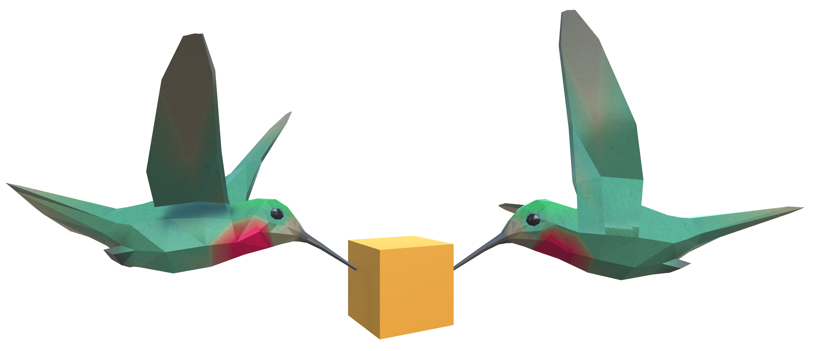

# Colibri

Provides easy model synchronization and easy access to data for faster cross reality prototyping for research.

## Features

Colibri focuses on three key areas:

- **Low Barrier:** Setup and Development is as simple as possible, with little to no configuration/code required.
- **Multi-Platform:** Colibri (currently) supports synchronization between Unity and Web.
- **Lab Conditions:** XR Research prototypes often benefit from ideal lab conditions, allowing Colibri to focus on low latency and high throughput (at the cost of potential bandwidth savings and some performance).

Included:

- Pub/sub messages on named channels
- Synchronized objects: `SyncTransform` and `SyncBehaviour` in Unity, `SyncModel` on the web
- Key-value store on the server
- Admin UI: the log of the server and its clients, the connected clients with latency and throughput, the synchronized models and the server settings
- Voice chat between Unity clients
- TLS for Unity (TCP) and web (HTTPS, WSS) connections, not for voice

## Components

| Component | Description |
| --- | --- |
| [colibri-unity](colibri-unity/README.md) | Unity client, Unity 2022.3 or newer |
| [colibri-web](colibri-web/README.md) | TypeScript client, [`@hcikn/colibri`](https://www.npmjs.com/package/@hcikn/colibri) on npm |
| [colibri-server](colibri-server/README.md) | Server. Runs as a [Docker image](https://hub.docker.com/r/hcikn/colibri) or on Node.js 24 or newer |

Clients and server must all be 2.x. Upgrading from 1.x: [MIGRATION.md](MIGRATION.md).

## Quick start

1. Start a server with [Docker Compose](colibri-server/README.md#docker) or [Node.js](colibri-server/README.md#nodejs).
2. Install the [Unity package](colibri-unity/README.md#installation) or run `npm install @hcikn/colibri@2`.
3. Follow the [tutorial](docs/getting-started.md).

## Testing

`npm test` in `colibri-server/` and `colibri-web/` runs the unit tests. `node colibri-unity/run-tests.mjs`
runs the Unity unit and end-to-end tests ([details](colibri-unity/docs/guide.md#running-the-tests)).

## Security

Colibri has no authentication. Any client that can reach a server can join any app on it and read
and change its data. Run the server on a trusted network.

## Citation

> Sebastian Hubenschmid\*, Daniel Immanuel Fink\*, Johannes Zagermann, Jonathan Wieland, Harald Reiterer, Tiare Feuchtner. In: *ISMAR'23 Adjunct.* 2023. **Colibri: A toolkit for rapid prototyping of networking across realities**. doi: [10.1109/ISMAR-Adjunct60411.2023.00010](https://doi.org/10.1109/ISMAR-Adjunct60411.2023.00010)

Published at the ISMAR'23 Adjunct "1st Joint Workshop on Cross Reality". Metadata: [CITATION.cff](CITATION.cff).
Contact: [Sebastian Hubenschmid](https://hci.uni-konstanz.de/personen/wissenschaftliche-mitarbeiterinnen/sebastian-hubenschmid/) ([GitHub](https://github.com/SebiH)), [Daniel Fink](https://hci.uni-konstanz.de/personen/wissenschaftliche-mitarbeiterinnen/daniel-fink/) ([GitHub](https://github.com/dunifi91)).

## Projects built with early Colibri versions

| [ReLive](https://github.com/hcigroupkonstanz/ReLive) | [STREAM](https://github.com/hcigroupkonstanz/STREAM) |
| --- | --- |
|  |  |
| [**Re-Locations**](https://github.com/hcigroupkonstanz/Re-locations) | [**ARound the Smartphone**](https://github.com/hcigroupkonstanz/ARound-the-Smartphone) |
|  |  |

## License

[MIT](LICENSE)
