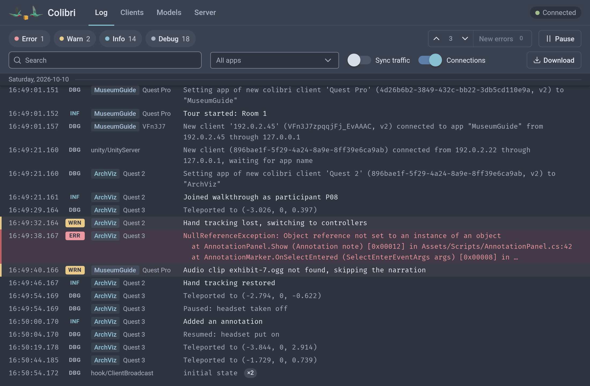
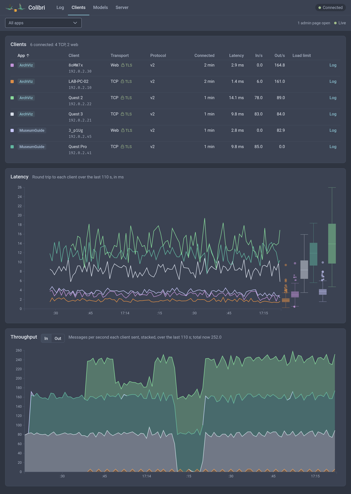
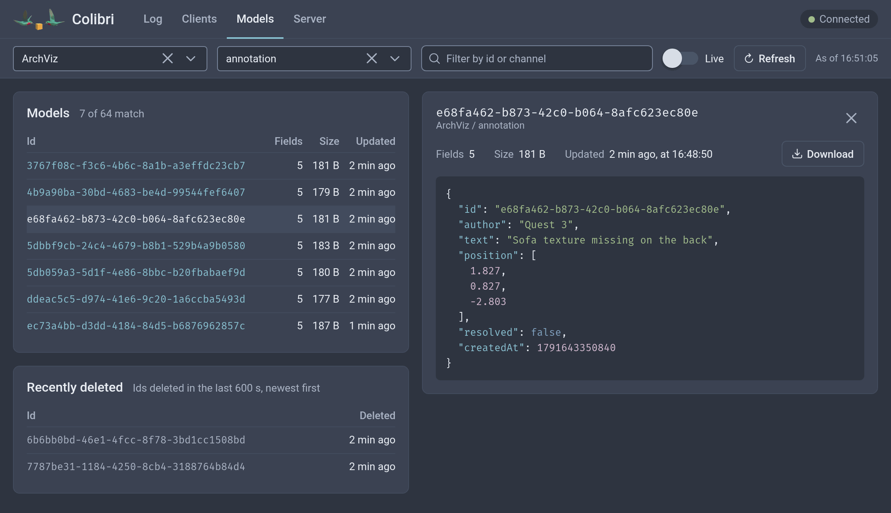
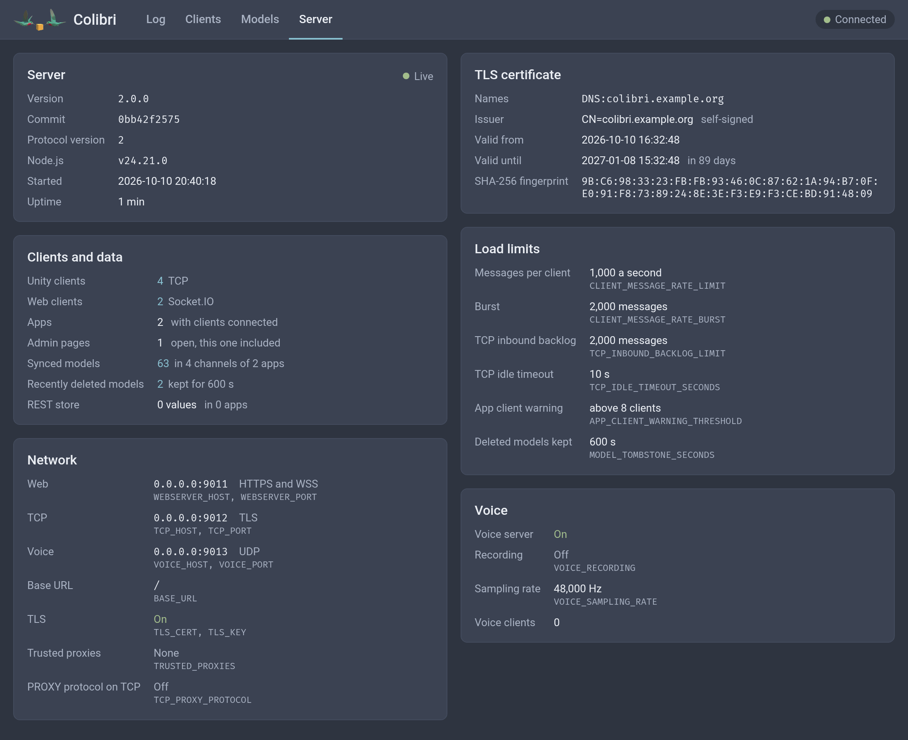
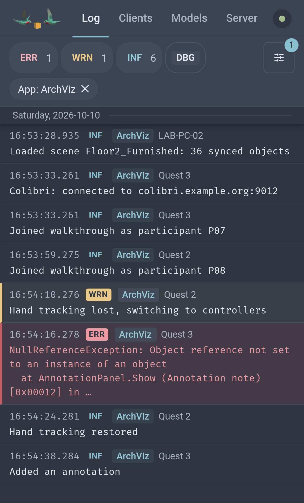

# colibri-server guide

Full reference for colibri-server. Overview: [README](../README.md). Wire protocol:
[protocol.md](protocol.md). Changes since 1.x: [v2-changelog.md](v2-changelog.md).

## Security

Colibri has no authentication. Anyone who can reach the ports can join any app, read and change its
data, and read the log, the connected clients and the server settings. Run the server on a trusted network.

## Setup

### Docker

Recommended. Image: [`hcikn/colibri`](https://hub.docker.com/r/hcikn/colibri). Save as
`docker-compose.yml` and run `docker compose up -d`:

```yaml
services:
  colibri:
    image: hcikn/colibri:2.0.0
    restart: unless-stopped
    container_name: colibri
    # Cap the log: Docker's json-file log never rotates, and client log lines are logged too.
    # Do not set `tty: true`, which mixes stderr into stdout in `docker logs`.
    logging:
      driver: json-file
      options:
        max-size: "10m"
        max-file: "5"
    volumes:
      - colibri-data:/srv/colibri/data
    ports:
      - 9011:9011 # admin UI, web clients, REST store
      - 9012:9012 # TCP, Unity clients
      - "9013:9013/udp" # voice

volumes:
  colibri-data:
```

Admin UI: `http://<server-ip>:9011`.

To build from a checkout, run `docker compose up -d` in `colibri-server`. That compose file builds the
image from source and keeps the data in `./data`. Alternatively, replace the `image:` line with
`build: <path to the checkout>/colibri-server`.

The image has no `.git`, so for the *Server* page to show the commit it was built from, pass it as
the build argument `COLIBRI_COMMIT`, and `COLIBRI_COMMIT_DIRTY=true` for a checkout with uncommitted
changes. The bundled compose file reads both from the environment:
`COLIBRI_COMMIT=$(git rev-parse HEAD) docker compose up -d --build`. In your own compose file, pass
them under `build:` the same way:

```yaml
    build:
      context: <path to the checkout>/colibri-server
      args:
        COLIBRI_COMMIT: ${COLIBRI_COMMIT:-}
        COLIBRI_COMMIT_DIRTY: ${COLIBRI_COMMIT_DIRTY:-}
```

Without compose: `docker build --build-arg COLIBRI_COMMIT=$(git rev-parse HEAD) .`.

The image sets `NODE_ENV=production` and runs the server as PID 1. On `docker stop`, the server
writes pending store changes and saves voice recordings in progress before it exits.

#### Data directory

`/srv/colibri/data` holds `store.json` and voice recordings. Mount the volume there and leave
`DATA_ROOT` unset. The container gives only this directory to the server's user. A volume mounted
elsewhere, with `DATA_ROOT` pointing at it, keeps its owner and is writable only if it belongs to uid
1000.

A named volume such as `colibri-data` needs no setup. For a host directory:

```yaml
    volumes:
      - ./data:/srv/colibri/data
```

This also works with a `./data` that Docker creates on first start, and with a root-owned `data`
directory from colibri-server 1.x, whose `store.json` format is unchanged. The container starts as
root, chowns `/srv/colibri/data` to `node` (uid 1000) if anything in it has another owner, and runs
the server as `node`. On the host, the directory then belongs to uid 1000.

#### Running as another user

With `--user` (or `user:` in the compose file), the container cannot change owners. The data
directory must already belong to that user, e.g. `sudo chown -R 1001:1001 ./data` for
`--user 1001:1001`. A new named volume belongs to uid 1000, like `/srv/colibri/data` in the image, so
it works only with `--user 1000:1000`. For another uid, use a host directory owned by that uid, or
drop `--user` so the container chowns the directory to `node`.

#### Unwritable data directory

If the server cannot write to its data directory, it prints `DATA_ROOT is not writable: <path>` on
stderr at startup, with the error, the server's uid and a fix. The admin UI log shows the error too.
The server keeps running but saves nothing. `store.json` and voice recordings stay in memory and are
lost when it stops. Restart the server after the fix.

| Error | Cause | Fix |
| --- | --- | --- |
| `EACCES`, `EPERM` | The server's uid may not write there | `chown -R <uid>:<gid> <path>`, with Docker on the host directory |
| `EROFS` | Read-only mount | Drop `:ro`, or point `DATA_ROOT` at a writable directory |
| `ENOTDIR`, `EEXIST` | The path or a parent is a file | Move the file, or point `DATA_ROOT` at a directory |
| `ENOSPC`, `EDQUOT` | Disk or quota full | Free disk space |
| Other | Not a writable directory | Make the path a directory the server's uid can write to, or point `DATA_ROOT` at one |

#### Settings and ports

Put [settings](#configuration) in `environment:`, e.g. `CONSOLE_LOG_LEVEL: debug`, or in a `.env`
file mounted at `/srv/colibri/.env`. To change a port, change only the host side of `ports:`, e.g.
`"8011:9011"`. If you set `WEBSERVER_PORT`, publish that port, e.g. `"9111:9111"`. The health check
reads `WEBSERVER_PORT` and `WEBSERVER_HOST` from the environment or the `.env` file.

### Node.js

Requires Node.js 24 or newer.

```sh
git clone https://github.com/hcigroupkonstanz/Colibri.git
cd Colibri/colibri-server
npm ci && npm run build && npm start
```

### Configuration

Set environment variables, or use a `.env` file in the working directory (`colibri-server` for
`npm start`). The environment takes precedence. [`.env.example`](../.env.example) lists every variable
with its default.

| Name | Default | Description |
| --- | --- | --- |
| `WEBSERVER_HOST`, `WEBSERVER_PORT` | `0.0.0.0`, `9011` | Admin UI, web clients (Socket.IO), REST store |
| `TCP_HOST`, `TCP_PORT` | `0.0.0.0`, `9012` | Unity clients |
| `VOICE_HOST`, `VOICE_PORT` | `0.0.0.0`, `9013` | Voice relay (UDP) |
| `VOICE_SAMPLING_RATE` | `48000` | Sampling rate of voice recordings, in Hz |
| `VOICE_RECORDING` | `false` | `true` saves each voice client's PCM audio as a `.wav` file in the data directory, named as in [Voice packets](protocol.md#voice-packets-udp) |
| `DATA_ROOT` | `../../data` | Data directory: `store.json` and voice recordings |
| `WEBSERVER_ROOT` | `../ui/` | Admin UI build output |
| `BASE_URL` | empty | Path of the admin UI, e.g. `/colibri` behind a reverse proxy. `/api/store` and Socket.IO stay at the root. |
| `STACK_TRACE_LIMIT` | `30` | Stack frames captured for a logged error |
| `CONSOLE_LOG_LEVEL` | `info` | Least severe level printed to stdout/stderr: `error`, `warn`, `info` or `debug` |
| `CONSOLE_LOG_BROADCAST_TRAFFIC` | `false` | `true` also prints every `broadcast::` message, regardless of `CONSOLE_LOG_LEVEL` |
| `TCP_INBOUND_BACKLOG_LIMIT` | `2000` | Messages from Unity clients that may wait for the main thread before [load limiting](#load-limits) starts. `0`: no limit. |
| `CLIENT_MESSAGE_RATE_LIMIT`, `CLIENT_MESSAGE_RATE_BURST` | `1000`, `2000` | `model::update` and `broadcast::` messages per second one Unity or web client may send, and the burst after a quieter period. Beyond that, [load limiting](#load-limits) applies. Catches runaway send loops. `0`: no limit. The burst must be at least 1. |
| `TCP_IDLE_TIMEOUT_SECONDS` | `10` | Seconds a Unity client may send nothing, heartbeat echoes included, before it is disconnected ([Idle timeout](#idle-timeout)). `0`: never. |
| `APP_CLIENT_WARNING_THRESHOLD` | `8` | Warn when one app has more clients than this, Unity and web together, admin UI excluded. Common cause: separate projects using the same app name. `0`: never. |
| `MODEL_TOMBSTONE_SECONDS` | `600` | Seconds a deleted synced object (model) is remembered. Meanwhile updates for it are ignored, so they cannot re-create it, and a re-request after a reconnect is answered with a delete. A client with the object in its scene again ends this early. Cleared with the app's models when its last client leaves. `0`: off. See [Deleted models](protocol.md#deleted-models). |
| `TLS_CERT`, `TLS_KEY` | empty | PEM files of the certificate with its chain, and of its private key. With both set, the TCP and web ports serve [TLS](#tls) only. |
| `TRUSTED_PROXIES` | empty | Reverse proxies trusted to report the client's address, and on the web port whether it used HTTPS: IP addresses, CIDR ranges and `loopback`, `linklocal`, `uniquelocal`, separated by commas, as in Express's `trust proxy`. Voice from them is relayed unchecked ([Voice relay](#voice-relay)). Empty: none. See [Behind a reverse proxy](#behind-a-reverse-proxy). |
| `TCP_PROXY_PROTOCOL` | `false` | `true`: a connection to the TCP port from a `TRUSTED_PROXIES` address must start with a PROXY protocol header, which names the Unity client. Requires `TRUSTED_PROXIES`. |

The `*_HOST` settings take an IPv4 address, an IPv6 address without brackets, or a host name. The
default `0.0.0.0` listens on IPv4 only. `::` listens on IPv6 and IPv4: set `TCP_HOST=::`,
`VOICE_HOST=::` and `WEBSERVER_HOST=::` for clients that reach the server over IPv6, e.g. a server
whose DNS name has only an AAAA record because its IPv4 address is behind carrier-grade NAT.
Another IPv6 address listens on that address only, without IPv4. Voice on `::` takes IPv4 too unless
the system makes IPv6 sockets IPv6-only (Linux: `net.ipv6.bindv6only=1`). Behind a reverse proxy or
Docker's published ports, it is the proxy or the published port that has to listen on IPv6, e.g.
nginx with `listen [::]:9012;` and `listen [::]:9013 udp;` in its `stream` servers. The server's own
settings can then stay at the default.

Unity clients connect and send voice over IPv4 when the server name has an IPv4 address, and over
IPv6 only when it has none, so both reach the server from the same address, as the
[voice check](#voice-relay) needs. If the name's IPv4 address does not answer on the TCP port while
its IPv6 address does, TCP falls back to IPv6, voice stays on IPv4, and the server drops the voice.

`DATA_ROOT` and `WEBSERVER_ROOT` may be absolute, e.g. `DATA_ROOT=/var/lib/colibri`. Relative paths
resolve from `dist/server`, so the defaults are `dist/ui` and `data` next to `dist`. In Docker, leave
`DATA_ROOT` unset ([Data directory](#data-directory)).

Invalid values stop the server at startup with `Invalid <NAME>: "<value>" is not ...`:

- a port that is not an integer from 1 to 65535
- a `VOICE_SAMPLING_RATE`, `STACK_TRACE_LIMIT` or `CLIENT_MESSAGE_RATE_BURST` that is not a positive
  integer
- another numeric setting that is not an integer of 0 or more
- an unknown `CONSOLE_LOG_LEVEL`
- a `TCP_PROXY_PROTOCOL` other than `true` or `false`
- a `TRUSTED_PROXIES` entry that is not an IP address, a CIDR range or one of the named ranges,
  including IPv4 shorthands such as `172.20`. An entry with an invalid prefix length, such as
  `10.0.0.0/33`, gives `Invalid TRUSTED_PROXIES: "10.0.0.0/33" has an invalid prefix length ...`.

`TCP_PROXY_PROTOCOL=true` with an empty `TRUSTED_PROXIES` stops the server too. So do unusable TLS
files ([Startup errors](#startup-errors)).

### Behind a reverse proxy

Behind a reverse proxy, every client comes from the proxy's address: in the log, in the admin UI and
for the per-address warning limits. A proxy that ends TLS connects unencrypted. `TRUSTED_PROXIES`
names the proxies trusted to report the client's address, and on the web port whether the client
used HTTPS:

- **Web port:** from a trusted peer, the client is the right-most `X-Forwarded-For` entry that is not
  itself a trusted proxy. A client can write anything into the header, and each proxy appends the
  address it got the request from, so the entries left of that are ignored. A peer that is not
  trusted is shown at its own address. Express's `req.ip` follows the same rule. As without a proxy,
  the address is also the client's `name` in `colibri::clients`, which every client of its app
  receives ([Server messages](protocol.md#server-messages)).
  From a trusted peer, the client used TLS to the proxy if the right-most `X-Forwarded-Proto` entry
  is `https` or `wss`, in any case. The admin UI then shows *TLS at proxy* ([Admin UI](#admin-ui)).
  The proxy must set this header, replacing the client's: nginx passes on what the client sent
  unless `proxy_set_header X-Forwarded-Proto $scheme;` is in each `location`, and a client on plain
  HTTP can then claim TLS. Only the admin UI's display depends on it.
- **TCP port:** with `TCP_PROXY_PROTOCOL=true`, a connection from a trusted peer must start with a
  PROXY protocol header, version 1 or 2, which names the Unity client
  ([PROXY protocol](protocol.md#proxy-protocol)). Other peers connect as before. The header does not
  say whether the proxy ended TLS, so the admin UI shows these connections as unencrypted either way.
- **Voice (UDP):** nginx's PROXY protocol covers TCP only, so voice sent through a proxy shows the
  proxy's address, and is relayed without the [voice check](#voice-relay). To keep the check,
  publish the voice port directly, as below, and keep the clients' addresses out of
  `TRUSTED_PROXIES`.

With Docker, publish the web and TCP ports on `127.0.0.1`, so that clients reach them only through
the proxy:

```yaml
    ports:
      - 127.0.0.1:9011:9011 # admin UI, web clients, REST store
      - 127.0.0.1:9012:9012 # TCP, Unity clients
      - "9013:9013/udp" # voice
```

The proxy then appears as the gateway of the Docker network, e.g. `172.20.0.1`, and its subnet can
change when compose recreates the network. The simplest setting trusts loopback and every private
address:

```yaml
    environment:
      TRUSTED_PROXIES: loopback,uniquelocal
      TCP_PROXY_PROTOCOL: "true"
```

A connection from a trusted address that does not come through the proxy can name any client
address: on the web port with its own `X-Forwarded-For`, on the TCP port with its own PROXY protocol
header. On the web port, its own `X-Forwarded-Proto` also shows it as *TLS at proxy*. With a new
address on each connection, it also gets past the per-address warning limits.
With the ports above, only processes on the host and containers on the compose network can connect
directly. `uniquelocal` also covers clients on a private network (`10.0.0.0/8`, `172.16.0.0/12`,
`192.168.0.0/16`, `fc00::/7`): such a client can do the same on the web port through the proxy, with
its own `X-Forwarded-For`, and its voice is relayed without the [voice check](#voice-relay). To limit this to processes on the host,
give the compose network a fixed subnet and trust only its gateway:

```yaml
    environment:
      TRUSTED_PROXIES: 172.30.0.1
      TCP_PROXY_PROTOCOL: "true"

networks:
  default:
    ipam:
      config:
        - subnet: 172.30.0.0/24 # any subnet not in use on the host
          gateway: 172.30.0.1
```

In nginx, add to each `location` that proxies to the web port:

```nginx
proxy_set_header X-Forwarded-For $proxy_add_x_forwarded_for;
proxy_set_header X-Forwarded-Proto $scheme;
```

and to the `stream` server that proxies to the TCP port:

```nginx
proxy_protocol on;
```

Restart the server with `TCP_PROXY_PROTOCOL=true` first, then reload nginx with `proxy_protocol on`.
Until both are done, every Unity connection through the proxy fails. In this order the log names the
missing header. In the other order, the server reads the header as a frame and logs an invalid frame
length, or with TLS on, a client that does not use TLS. At startup the log shows:

```
Starting Colibri TCP server on 0.0.0.0:9012, PROXY protocol header required from TRUSTED_PROXIES (loopback, uniquelocal)
```

| Message | Cause | Fix |
| --- | --- | --- |
| WARN `Refusing a connection from <address>: it is in TRUSTED_PROXIES and TCP_PROXY_PROTOCOL is true, but the connection does not start with a PROXY protocol header ...` | The proxy sends no header, or a client connects directly from a trusted address | `proxy_protocol on;` in the proxy |
| WARN `Refusing a connection from <address>: it is in TRUSTED_PROXIES and TCP_PROXY_PROTOCOL is true, but it sent no complete PROXY protocol header within 10 s ...` | As above, with a client that sends nothing | As above |
| WARN `Refusing a connection from <address>: its PROXY protocol header is invalid: ...` | A malformed header, a version 1 header over 107 bytes, or a version 2 header over 4 KiB after its fixed 16 bytes | Check the proxy's PROXY protocol settings |
| WARN `Refusing a connection from <address>: it starts with a PROXY protocol header, but its address is not in TRUSTED_PROXIES ...` | The proxy's address is not trusted, e.g. after the Docker network changed | Add it to `TRUSTED_PROXIES` |
| ERROR `Invalid frame from client <id>, ...: Invalid frame length: 1481593424`, or with TLS on, WARN `Refusing a connection from <address>: it does not use TLS ...` | The proxy sends a header, but `TCP_PROXY_PROTOCOL` is not set | Set `TCP_PROXY_PROTOCOL=true` |

The refusals are logged at most once a minute per address, repeats at debug level.

## TLS

With `TLS_CERT` and `TLS_KEY` set, the TCP port (9012) accepts only TLS and the web port (9011) serves
only HTTPS and WSS, admin UI included, both with one certificate. Without them, both stay
unencrypted. There is no mixed mode. Every client must use TLS:

- **Unity:** tick *Server supports SSL/TLS?* in the Colibri configuration
  ([Unity guide](../../colibri-unity/docs/guide.md#tls)).
- **Web clients and admin UI:** use `https://<host>:9011` or `wss://<host>:9011`
  ([web guide](../../colibri-web/docs/guide.md#tls)). `http://<host>:9011` is closed without an
  answer, not redirected.

Frames and protocol version are unchanged inside TLS ([protocol](protocol.md#tls)). TLS does not
authenticate clients. Anyone who can reach the ports can still join any app. Voice (UDP) stays
unencrypted.

### Enabling TLS

| Name | Content | Let's Encrypt file |
| --- | --- | --- |
| `TLS_CERT` | PEM certificate, followed by its chain | `fullchain.pem` |
| `TLS_KEY` | PEM private key of that certificate, without a passphrase | `privkey.pem` |

Set both or neither, as absolute paths. Relative paths resolve from `dist/server`, like `DATA_ROOT`.
RSA and EC certificates both work. The server does not create certificates. Use one from a
certificate authority such as Let's Encrypt or your institution, or a
[self-signed one](#self-signed-certificate).

At startup the log shows `Web server listening on 0.0.0.0:9011, HTTPS and WSS only`,
`Starting Colibri TCP server on 0.0.0.0:9012, TLS only` and the certificate:

```
TLS is on, with the certificate in /srv/colibri/certs/fullchain.pem and the key in /srv/colibri/certs/privkey.pem: for DNS:colibri.example.org, IP Address:192.0.2.10, self-signed, valid until 2036-10-05T12:00:00.000Z; SHA-256 fingerprint 83:88:B1:CD:...
```

A Unity app can pin the fingerprint as *Server certificate SHA-256*. Case and colons are ignored
there. A self-issued certificate shows as `self-signed`, e.g. openssl's default, a server-only one from
PowerShell's `New-SelfSignedCertificate`, or colibri-unity's test certificate. For these, the line
adds how a Unity app and a browser can accept it. A certificate from an authority shows
`issued by <issuer>`.

### Self-signed certificate

```sh
openssl req -x509 -newkey ec -pkeyopt ec_paramgen_curve:prime256v1 -nodes -keyout privkey.pem -out fullchain.pem -days 3650 -subj "/CN=colibri.example.org" -addext "subjectAltName=DNS:colibri.example.org,IP:192.0.2.10"
```

Replace `colibri.example.org` and `192.0.2.10` with the name and IP address clients connect to. For
RSA, use `-newkey rsa:2048` instead of `-newkey ec -pkeyopt ec_paramgen_curve:prime256v1`. Git for
Windows ships openssl in `usr/bin`. The certificate is valid for 10 years.

Unity apps accept it by fingerprint ([Unity guide](../../colibri-unity/docs/guide.md#tls)). A browser
must trust it once. Open `https://<host>:9011` and accept it, or install it.

### TLS with Docker

```yaml
    environment:
      TLS_CERT: /srv/colibri/certs/fullchain.pem
      TLS_KEY: /srv/colibri/certs/privkey.pem
    volumes:
      - colibri-data:/srv/colibri/data
      - ./certs:/srv/colibri/certs:ro
```

- **Mount the directory, not the two files.** A single-file bind mount stays on the file it found at
  start and misses a renewal that replaces it.
- **uid 1000 must be able to read the key.** The server runs as the image's `node` user. openssl
  creates `privkey.pem` readable by its owner only. If the owner is not uid 1000, run
  `sudo chown 1000 certs/privkey.pem`.
- **Let's Encrypt:** `live/` holds symbolic links into `../../archive`, which resolve only with all of
  `/etc/letsencrypt` mounted, and `privkey.pem` is readable by root only. Copy both files with a
  certbot deploy hook, which certbot runs after every renewal. Example
  `/etc/letsencrypt/renewal-hooks/deploy/colibri.sh` (executable), with `/opt/colibri/certs` mounted
  at `/srv/colibri/certs`:

  ```sh
  #!/bin/sh
  install -o 1000 -g 1000 -m 600 "$RENEWED_LINEAGE/fullchain.pem" "$RENEWED_LINEAGE/privkey.pem" /opt/colibri/certs/
  ```

  Run it once manually for the current certificate, with
  `RENEWED_LINEAGE=/etc/letsencrypt/live/<your domain>`.
- `colibri-server/docker-compose.yml` has these lines, commented out.
- With TLS on, the health check uses HTTPS without verifying the certificate, so a container with a
  self-signed certificate is reported healthy.

### Renewal

The server reads both files every 10 s and switches once two consecutive reads match, so a renewed
certificate is in use within about 20 s, without a restart. Open connections keep their certificate.

If the new contents cannot be used, e.g. the certificate is renewed but the key not yet replaced, or
the files cannot be read, the server warns once and keeps the old certificate. It also warns once when
the certificate is not valid yet, has expired, or expires within 7 days or within the last fifth of its
lifetime, whichever is shorter.

### Startup errors

With TLS configured, these stop the server at startup. Each message names the variable, the file and
the fix.

| Message | Cause | Fix |
| --- | --- | --- |
| `TLS_CERT is set, but TLS_KEY is not.` or the reverse | Only one is set | Set both or neither |
| `Cannot read TLS_CERT (<path>): ...` or `TLS_KEY` | Missing, a directory, or not readable for the server's uid | Name a PEM file the server can read |
| `TLS_CERT (<path>) holds no certificate the server can use ...` | Not a PEM certificate, e.g. swapped with the key | Point `TLS_CERT` at the certificate |
| `TLS_KEY (<path>) holds no private key the server can use ...` | Not a PEM private key | Point `TLS_KEY` at the key |
| `TLS_KEY (<path>) is not the private key of the certificate in TLS_CERT ...` | Key of another certificate, including an RSA key with an EC certificate or the reverse. OpenSSL accepts such a pair and then fails every handshake. | Use the key that belongs to the certificate |
| `TLS_KEY (<path>) is protected by a passphrase ...` | The key has a passphrase | `openssl pkey -in <protected key> -out <key>` |
| `TLS_CERT (<path>) and TLS_KEY (<path>) cannot serve TLS together: ...` | OpenSSL rejects the pair for another reason | See the OpenSSL error in the message |

### TLS log messages

| Message | Cause | Fix |
| --- | --- | --- |
| WARN `Refusing a connection from <address> (Unity client '<name>', app '<app>'): it does not use TLS ...` | *Server supports SSL/TLS?* not ticked | Tick it |
| WARN `Refusing a connection from <address>: it looks like a Colibri 1.x client, which cannot use TLS ...` | Colibri 1.x client on the TLS port | Upgrade the Unity package to 2.x and tick *Server supports SSL/TLS?* |
| WARN `Refusing a connection from <address>: it starts a TLS handshake, but this server's TCP port does not use TLS ...` | *Server supports SSL/TLS?* ticked, server without TLS | Untick it, or enable TLS |
| INFO `TLS handshake with <address> failed: ...` | The client refused the certificate, closed the connection during the handshake (a common way to refuse one), or timed out | Follow the certificate hint in the message |
| WARN `TLS_CERT or TLS_KEY has changed, but cannot be used: ... Still serving the certificate with SHA-256 fingerprint ...` | Incomplete or broken renewal | See [Renewal](#renewal) |

Refusals and failed handshakes are logged at most once a minute per address. Repeats are logged at
debug level.

### Reverse proxy

TLS can instead terminate in an existing reverse proxy, with `TLS_CERT` and `TLS_KEY` unset. For the
TCP port, use nginx's `stream` module with `listen 9012 ssl`, or a Traefik TCP router with TLS.
Colibri needs no changes. Unity apps tick *Server supports SSL/TLS?* when the proxy's TCP port uses
TLS. To show each client at its own address rather than the proxy's, and web clients with TLS at the
proxy in the admin UI, see [Behind a reverse proxy](#behind-a-reverse-proxy).

### Performance

Cost of TLS compared with unencrypted, measured on a shared 4-core Linux host with Node 24, with 30
to 60 Unity-like clients sending 10 objects each at 20 to 30 Hz, and as many web clients:

- **Bytes:** about +15% from Unity to the server (29 bytes per TLS 1.2 record, frames of about 190
  bytes), +11% from the server to Unity, +3 to 4% on WSS.
- **CPU:** +4 to 5 percentage points (about +10%) on the TCP worker thread, which encrypts and
  decrypts the Unity traffic. 11 to 17 points less on the main thread, because Node packs many small
  WSS frames into fewer TLS records and send calls. Behind a TLS-terminating proxy, this saving is
  lost.
- **Latency:** median unchanged, within noise.
- **Connecting:** about +1 ms for the TCP connect. Median TLS handshake 4 to 5 ms with 120 clients
  connecting at once.

The cost of TLS on a headset was not measured.

## Features

- **Admin UI** at `http://<server-ip>:9011` (`https://` with [TLS](#tls)), on a phone too: the log
  of the server and every connected client, the connected clients, the synchronized models and the
  settings in effect ([Admin UI](#admin-ui)).
- **Model synchronization** and **broadcasts** between the Unity (TCP) and web (Socket.IO) clients of
  an app. The server keeps a copy of each app's models. Only `broadcast::` messages and model changes
  are relayed to other clients ([Relayed messages](protocol.md#relayed-messages)).
- **REST store** at `/api/store` on the web port, saved to `store.json` in the data directory
  ([REST store](protocol.md#rest-store)).
- **Voice relay** on UDP port 9013. A voice packet goes to the other clients of the sender's app that
  send voice to this server, if a Unity client of that app is connected from the sender's address
  ([Voice relay](#voice-relay)). Voice is not encrypted.

### Logs

Server messages, and lines clients send through colibri-unity's `RemoteLogging` or colibri-web's
`RemoteLogger`, go to:

- **stdout and stderr:** one line per message, `<time> <LEVEL> [<group>/<service>] <message>`, errors
  and warnings on stderr. `docker logs colibri` shows them, including refused clients, failed
  `store.json` writes and client errors. `CONSOLE_LOG_LEVEL` sets the minimum level (default:
  everything but debug). `broadcast::` messages appear only with `CONSOLE_LOG_BROADCAST_TRAFFIC=true`.
- **Admin UI *Log* page:** the last 20,000 messages of every level, in memory, repeats of a line merged
  into one entry per client. The page loads the newest 10,000 that match its filters and shows a
  repeat where it last occurred. Lost on restart. Times are the browser's local time; hover one for
  UTC, as `docker logs` prints it.

### Admin UI

Four pages, all read only: nothing on them changes, deletes or disconnects anything. They read from
the server over the Socket.IO channel `colibri::admin` ([Admin UI channel](protocol.md#admin-ui-channel)).
The server refreshes a subscribed page every second, with bounded sizes. While no page is open, it
keeps each client's latency samples and message rates of the last 2 minutes, which a page shows as
soon as it opens. `npm run demo` fills the pages with synthetic clients ([Development](#development)).

- **Log:** the [log](#logs), filtered by app and level, with a search over the loaded lines. *Sync
  traffic* shows the `broadcast::` messages between clients; *Connections* off leaves out the routine
  connect and disconnect lines, not the warnings and errors about connections. Scrolling up pauses
  the log; click a line for its details and a link to the clients of its app. The arrows go to the
  previous and next error or warning, *New errors* to the first error since the page was opened, by
  the server's clock.
  *Download* saves the loaded lines that match the filters and the search, as text or as JSON; unlike
  the clipboard, it works over plain HTTP. The filters are in the address, so a reload or a copied
  link keeps them: `/log?levels=error,warn&q=timeout&sync=1&connections=0#MyApp`.

  

- **Clients:** every connected Unity (TCP) and web client with its app, name, address (behind a
  [trusted proxy](#behind-a-reverse-proxy), the one the proxy names), transport and TLS (*TLS at
  proxy* for a web client that reached a trusted proxy over HTTPS), protocol version, time
  connected, latency, messages per second in and out over the last second, and whether a
  [load limit](#load-limits) holds its updates back: *Rate limit* or *Backlog*, with the number of
  objects held. Sort by a column, show one app (`/clients?app=MyApp`), and open a client's lines in
  the log. While the mouse is over the rows, they keep their order. Below, each client's latency over
  the last 2 minutes, and its messages per second over the same time, stacked: *In* what the clients
  sent, *Out* what they were sent (`/clients?throughput=out`). Both charts show the whole 2 minutes as
  soon as the page opens. The former *Statistics* page, `/statistics`, leads here.

  

- **Models:** the synchronized models of each app and channel, 50 to a page, with their id, number
  of top-level fields, size as compact JSON and time since the last update, filtered by part of the
  id or channel. A size can be up to 10 s old, from 1 MiB up to a minute. Click one for its value as
  JSON, to read or download; a value over 512 KiB is cut, and its start downloads as text. Below,
  the newest ids deleted within `MODEL_TOMBSTONE_SECONDS`. *Refresh* reads the list again; *Live*
  updates the list and the open model every second.

  

- **Server:** version, the commit it was built from (the full hash and build time on hover,
  *uncommitted changes* for a build with changes not committed, *unknown* without git information),
  protocol version, Node.js version and uptime; the settings in effect, with the variables that set
  them: ports, `BASE_URL`, TLS, `TRUSTED_PROXIES`, `TCP_PROXY_PROTOCOL`, load limits, idle timeout,
  tombstones, voice and recording; without a certificate, and while a web client or admin page is
  connected through a [trusted proxy](#behind-a-reverse-proxy) that reports HTTPS, the web port as
  *HTTP here, HTTPS at the proxy* and TLS as *Not on this server*; the TLS certificate's names,
  issuer, validity and SHA-256 fingerprint, with a warning 30 days before it expires; and counts of
  clients, apps, synchronized models and REST store values. Never certificate or key paths, key material or file contents.

  

On a phone, the log's search, app filter and switches are behind the button at its top right.



Keys on the *Log* page, with the focus in the log or its toolbar (where a page just loaded puts it):
`/` search, `p` and `n` previous and next error or warning, `e` first new error. On the *Models* page,
`Esc` closes the open model.

### Load limits

Every message is relayed to every other client of the app, so the server's work grows with the square
of an app's size. Give each project on a shared server its own app name. Each time an app grows past
`APP_CLIENT_WARNING_THRESHOLD` clients, the server logs a warning naming it, e.g.
`App 'MyApp' now has 9 clients, more than 8 (APP_CLIENT_WARNING_THRESHOLD) ...`.

When the main thread is `TCP_INBOUND_BACKLOG_LIMIT` messages behind the Unity clients, or one client
sends more than `CLIENT_MESSAGE_RATE_LIMIT` messages a second, the server holds back `model::update`
and drops `broadcast::` messages, so its memory and delay stay bounded. Held updates are merged per
object, so the latest value of every field still arrives, only later. Nothing else is held back or
dropped. Synced objects move less smoothly for the other clients. Updates are held for at most 1000
objects per client. An update for one more object is lost, and that object reaches the server and the
other clients only when it changes again.

An overload lasting a second logs a warning naming `TCP_INBOUND_BACKLOG_LIMIT`, or
`CLIENT_MESSAGE_RATE_LIMIT` and the client, and another at its end with the numbers held back and
dropped. A shorter one logs a debug line, or a warning if it lost updates.
[Inbound limits](protocol.md#inbound-limits) lists the warnings and their effect on clients.

- **Backlog warning:** the server as a whole receives more than it can process. Sync fewer objects,
  less often, or with fewer clients per app.
- **Rate warning:** the named client sends far more than the others, usually because it sends every
  frame without a rate cap. Normal clients stay far below the limit. Syncing 10 objects at 72 Hz sends
  720 updates a second.

### Idle timeout

The server sends each Unity client a heartbeat ten times a second, and the client echoes it. A Unity
client silent for `TCP_IDLE_TIMEOUT_SECONDS` (10 s) is disconnected as if it had closed the
connection, with the warning
`Unity client '<name>' (<id>, app '<app>', <address>) has sent nothing for <n> s ...`. The other
clients of its app receive `client::disconnected`, and if it was the last client, the app's models are
cleared. This detects a headset that left the Wi-Fi or went to sleep without closing its connection,
which the operating system notices only after many minutes. A connection without a handshake within
this time is closed too.

A message over 64 KiB contains no heartbeat, so a client reading it over a slow link echoes nothing
until it is through. Until the client echoes a heartbeat sent after that message, its timeout is
extended by one `TCP_IDLE_TIMEOUT_SECONDS` per 64 KiB of the message, at most 6 times (60 s at the
default). A 4 MiB message therefore needs about 60 KB/s or more. A slower client is disconnected, and
the warning names the message size. Smaller messages need no extra time. A headset that is gone when
such a message is sent, or goes while reading it, is detected within 7 timeouts (70 s) at worst
([Heartbeat / latency](protocol.md#heartbeat--latency)).

colibri-unity echoes heartbeats off Unity's main thread, so a long scene load does not trigger the
timeout. A debugger stopped at a breakpoint usually pauses all threads and does trigger it. For long
breakpoints against your own server, raise `TCP_IDLE_TIMEOUT_SECONDS` or set it to `0`. Web clients
are not affected. Socket.IO's own ping detects a lost web client within about 45 s.

### Voice relay

Each voice packet carries its app as an app id, the hash of the app name
([Voice packets](protocol.md#voice-packets-udp)). The server relays a packet, and relays voice to its
sender, only if a Unity client of that app is connected on the TCP port from the packet's source
address. Anyone can compute an app id and forge a UDP source address and port. Without the check, one
forged packet every 2 s would have the server send an app's voice to any address.

Each source address and port is a voice client, and is sent the app's voice. An address gets at most
one voice client of an app per Unity client of that app connected from it, so forged packets from
other ports at a participant's address cannot multiply the voice sent there. A sender over that
number takes the place of the voice client that has gone the longest without a packet, if that is
500 ms or more, as when a Unity client's voice socket is opened again on a new port. When a Unity
client disconnects, the voice clients of its app at its address over the number of Unity clients left
there are dropped within 1.5 s, the one quiet the longest first. With none left, all of them are
dropped at once.

The server learns a voice client's address only from the packets it sends, and drops a voice client
after 2 to 3 s without one. A client that only listens receives nothing: it has to send voice too.

Other packets are dropped. A Unity client's voice often starts a moment before its TCP handshake is
in, so the first packet dropped from a source is only a debug line. The source is reported as a
warning once its packets have been dropped for 3 s, at most once every 10 s:

| Warning | Cause |
| --- | --- |
| `Ignoring voice packet from <address>:<port> for app <app id>: no Unity client of that app is connected from <address> ...` | The client's voice and its TCP connection reach the server from different addresses, e.g. through a proxy, or TCP fell back to IPv6 because the server name's IPv4 address does not answer on the TCP port ([Configuration](#configuration)). |
| `Ignoring voice packet from <address>:<port> for app <app id>: <address> has <n> Unity client(s) of that app, and as many voice clients already ...` | More voice sockets than TCP connections of that app send from the address, or someone forges packets from it. |

Voice from an address in `TRUSTED_PROXIES` is relayed without the check and the limit, since through
a proxy every packet comes from the proxy's address. The server logs this once per address:
`Relaying voice from <address> unchecked: it is in TRUSTED_PROXIES ...`. With `uniquelocal` trusted,
that is every private address, and a forged private source address gets past the check. To keep the
check, publish the voice port directly and trust only the proxy's address
([Behind a reverse proxy](#behind-a-reverse-proxy)).

The check is not access control. Anyone who can reach the TCP port can join any app, and send and
receive its voice. An address with n Unity clients of an app can still be sent n copies of the app's
voice, as many as those clients get when all of them send voice: a forged sender can take the place
of one that sends none, and keep that client out while it sends at least every 0.5 s. Voice is not
encrypted, with [TLS](#tls) on too.

## Protocol version

Web clients use Socket.IO, Unity clients a custom binary protocol over TCP
([protocol.md](protocol.md)).

**Breaking change:** v2.0.0 introduces the v3 framing. colibri-unity 1.x cannot connect. colibri-web
1.x is refused too, although the Socket.IO envelope is unchanged. Update both to 2.x.

Both transports send a protocol version in the handshake, and the server refuses every version but its
own, without negotiation. A refused client receives the reason on the `colibri` channel, is
disconnected and never appears in the admin UI. The log names both versions. colibri-unity 1.x cannot
read the refusal, so the server detects its 1.x framing and logs a warning naming the address and the
package to upgrade, at most once a minute per address ([Version checking](protocol.md#version-checking)).

## Development

- `npm ci`: install the dependencies.
- `npm run watch`: development server, recompiles and reloads on changes. Records no commit: it
  removes `dist/server/build-info.json`, and the *Server* page shows the commit as unknown.
- `npm run build`: compile. Records the commit in `dist/server/build-info.json`, from
  `COLIBRI_COMMIT` and `COLIBRI_COMMIT_DIRTY` (`true`) if set, else from git.
- `npm start`: start the server. Compile first.
- `npm run publish`: maintainers only. Builds the image with the commit, then pushes
  `hcikn/colibri:<version>` and `hcikn/colibri:latest`.
- `npm run lint`: lint the server and admin UI sources.
- `npm test`: vitest unit tests. The TLS tests need `openssl` on `PATH` (Git for Windows ships it in
  `usr/bin`). In a test,
  `createTestCertificate(dir, name, { commonName, keyType: 'ec' | 'rsa', signedBy, serverOnly })`
  from [`test/tls-test-certificate.ts`](../test/tls-test-certificate.ts) creates a certificate valid
  for 2 days, self-signed or signed by another test certificate.
- `npm run gui:test`: admin UI unit tests.
- `npm run bench`: vitest benchmarks. Results depend on machine and runtime, so report them in the pull
  request that claims them instead of committing them. Always compare before and after on the same
  machine and Node version.
- `npm run test:vectors`: checks that colibri-unity's protocol test vectors match this server's
  encoder, and that colibri-web, colibri-unity and the admin UI announce this server's protocol
  version. Runs in CI. `npm run test:vectors -- --emit` prints the C# vector table.
- `npm run test:tcpclient`: manual smoke test against a server on this machine on `TCP_PORT`. Sends a
  v3 handshake, then echoes heartbeats.
  - `-- 1`: announce protocol version 1 to provoke a refusal.
  - `TCP_PORT=<port> npm run test:tcpclient -- --tls`: connect over TLS and print the SHA-256
    fingerprint of the server's certificate. Add `--insecure` for an untrusted certificate, e.g. a
    self-signed one, and `--host <name>` for another machine.
  - Exit codes: `0` connected and heartbeats received, `2` refused (prints the server's reason), `1` no
    heartbeat, or an undecodable frame (prints `Malformed frame from server` and ends the run).
  - `tsx test/tcp-crosstalk-check.ts [app] [ms] --tls [--insecure] [--host <name>]`: manual probe with
    the same TLS options.
- `npm run test:stressecho`: raw TCP client that answers the probes of colibri-unity's Network Stress
  sample, so one Unity editor can measure round trips (`npm run test:stressecho -- [app] [seconds]`).
- `npm run demo`: synthetic clients against a running server, so the admin UI has data to show without
  headsets. Two apps: `ArchViz` (a Unity editor, Quest 3, Quest 2 and a web dashboard) and `MuseumGuide`
  (Quest Pro and a web kiosk), with avatars synced at 30 Hz, log lines of every level including an
  exception, annotations added and deleted, and a headset that leaves and rejoins. The scene repeats
  every 3 minutes, and clients reconnect after a server restart, so it can run for hours. The server
  receives up to about 250 messages a second from them and sends up to about 550.
  - `-- --minutes <n>`: stop after n minutes, at most 35791 (about 24.8 days). Default: run until Ctrl+C.
  - `-- --apps <n>`: n copies of both apps, the others named `ArchViz-2`, `MuseumGuide-2` and so on,
    each with the same load.
  - `--web-port <port>`, `--tcp-port <port>`: default `WEBSERVER_PORT` and `TCP_PORT`. `--host <name>`:
    default `localhost`, which reaches a server on `127.0.0.1` or `::1`. `--tls` and `--insecure` as for
    `test:tcpclient`.
- `npm run test:docker`: requires Docker. Builds the image, or uses `COLIBRI_DOCKER_IMAGE`, and runs
  it in each deployment in the table. Pass deployment names to run only those.

  | Deployment | Setup |
  | --- | --- |
  | `bind-missing-dir` | Bind mount of a directory Docker creates |
  | `bind-root-owned-1x` | Root-owned 1.x data directory |
  | `named-volume` | Named volume |
  | `user-1000-named-volume` | `--user 1000:1000` on a named volume |
  | `user-1000-root-owned-dir` | `--user 1000:1000` on a root-owned directory |
  | `bind-read-only` | 1.x data mounted read-only |
  | `bind-world-writable-no-chown` | 1.x data without `CAP_CHOWN` |
  | `web-port-9111` | `WEBSERVER_PORT` in the environment |
  | `web-host-localhost` | `WEBSERVER_HOST=localhost` |
  | `web-port-from-env-file` | `WEBSERVER_PORT` in a mounted `.env` |
  | `tls-self-signed` | TLS on both ports |

  Each run must become healthy, stop cleanly and keep saved data across a restart, or, where it cannot
  save, report that with advice for the cause. With TLS, it also checks the served certificate, the
  refusal of a client without TLS, and renewal without a restart, which needs `openssl` on `PATH`.
  Each container is removed after its deployment, everything else at the end.
  `COLIBRI_DOCKER_PREFIX`, `COLIBRI_DOCKER_PORT` and `COLIBRI_DOCKER_TMPDIR` are described at the top
  of [`test/docker-image-check.ts`](../test/docker-image-check.ts).
