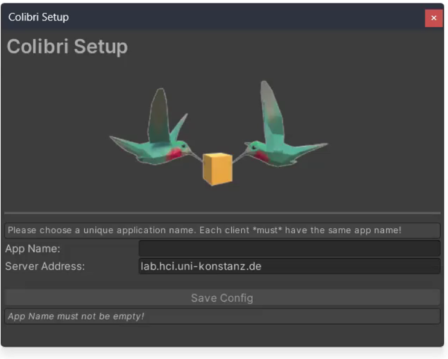
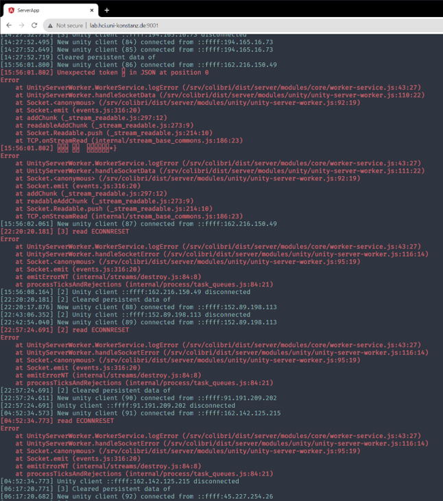
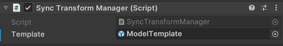

# Colibri Unity

## Requirements

- Unity 2022.3 LTS or higher
- **colibri-server 2.0.0 or higher.** Colibri Unity 2.0.0 speaks the [v3 binary TCP
  protocol](../colibri-server/docs/protocol.md) and **cannot talk to a 1.x server** — there is no
  version negotiation, both sides have to be upgraded together. Colibri Unity 1.x likewise cannot
  talk to a 2.0.0 server. A mismatch is not silent: the server refuses the connection and says
  so, `Window → Colibri Status` shows the mismatch in red, and the client stops reconnecting
  instead of retrying forever.

## Installation

One URL. In Unity, open *Window → Package Manager → + → Install package from git URL* and paste:

```
https://github.com/hcigroupkonstanz/Colibri.git?path=colibri-unity/Assets/Colibri
```

Colibri's only dependency is `com.unity.nuget.newtonsoft-json`, which the Package Manager
installs by itself.

### UnityPackage

Alternatively, download the latest [Colibri release](https://github.com/hcigroupkonstanz/Colibri/releases) from GitHub and import it into your project. Installed this way, Newtonsoft JSON has to be added by hand from the Package Manager (`com.unity.nuget.newtonsoft-json`) — a `.unitypackage` cannot declare dependencies.

## Quickstart

1. Install Colibri (above). A configuration window opens on its own.
2. Enter an **App Name** — any word you like, but every client that should see each other has to
   use the *same* one — and press *Save Config*. The default server
   (`colibri.hci.uni-konstanz.de`) works out of the box.
3. Import the **SendData** sample: *Window → Package Manager → Colibri → Samples → Import*.
4. Open the sample scene and press Play. Tick `SendProperties` on the `SendMessages` object and
   watch the console.
5. Turn on *Project Settings → Player → Resolution and Presentation → **Run In Background***.
   Unity leaves this off by default, and with it off the Editor stops running your game the
   moment its window loses focus. The connection stays up and the status window still says
   *Connected* — but nothing is sent and nothing that arrived is delivered, because none of that
   happens until `Update` runs again. It is the single most confusing way for two clients on one
   machine to appear broken.
6. To see two clients talk to each other, build the scene and run the build alongside the Editor —
   or open the project a second time from the Unity Hub.

Stuck? Open **Window → Colibri Status**. It shows whether you are connected, which app name you
are connected as, which channels have listeners, and the last messages in and out.

## Configuration

Upon installation, a configuration window should show up:



- Enter the URL of your (shared) [server](../colibri-server). A public test server can be found at `colibri.hci.uni-konstanz.de` (beware of network latency!)
- Choose a unique *app name*. Though a server supports multiple clients, data is only synchronized between clients with identical *app names*!
- To adjust the Colibri Configuration you can reopen the window in Unity under "Window" -> "Colibri Configuration" 
- All changes are saved to `Resources/ColibriConfig`

### Advanced Configuration

If your server is running a non-default configuration, the advanced configuration allows you modify server ports.
Do not modify port numbers unless you know what you are doing!

The Remote Store talks to the server over REST. With the `SSL/TLS` toggle off those requests go
out as plain `http`, and Unity blocks cleartext HTTP by default. **Loopback is exempt**, so a
server on `localhost` needs no change at all — this only comes up once the server is a real
remote host that is not on HTTPS. In that case set *Project Settings → Player → Other Settings →
**Insecure HTTP Option*** to *Always allowed*, or put the server behind HTTPS and turn `SSL/TLS`
back on.

When using the voice chat, Colibri allows to adjust the sampling rate on the server. In this case, clients need to manually set the `Voice Sampling Rate` setting in the configuration.

Default values:

- Web server Port: `9011`
- TCP server Port: `9012`
- Voice server Port: `9013`
- Voice Sampling Rate: `48000`

## Samples

Samples live in the `Samples` tab of the Package Manager: select Colibri, then *Samples →
Import*. Importing copies a sample into `Assets/Samples/Colibri/`, which is yours to edit — the
package's own copy is not compiled into your project until you import it, so nothing you never
asked for ends up in your build.

The `[RemoteLogger]` and `[SyncTransformManager]` prefabs are **not** samples: they are part of
the package proper. Drag them straight out of `Packages/Colibri/Prefabs/` in the Project window.

## Troubleshooting

Open **Window → Colibri Status** while the game is running. It shows, at a glance:

- whether you are connected, to which server, and **as which app name** — a typo there gives a
  perfectly healthy connection on which no other client is ever seen
- whether the server's heartbeat is still arriving, and how long the silence has been if not
- every channel that has listeners, and the type each one expects
- the last 20 messages sent and received

Colibri also reports the common mistakes in the console rather than failing quietly:

| Symptom | What Colibri tells you |
|---|---|
| Nothing arrives, no errors | `a float arrived on channel 'chat', but the listener registered there expects string…` — the channel *and* the type have to match |
| Nothing connects, no errors | `Colibri is not configured yet. Open Window → Colibri Configuration…` |
| Two clients don't see each other | The connect log names the app name in use; both clients must show the same one |
| A `[Sync]` field never syncs | Its type is reported at startup if Colibri cannot put it on the wire |
| Connected, but one client is silent | That client's Editor window is in the background and *Run In Background* is off — see step 5 of the Quickstart |
| `Store.Get`/`Put` reports a failure | The log names the operation, the object, the URL, the transport error and the HTTP status; requests give up after 10 s rather than hanging |

## Documentation

### Web Interface for Logging



Colibri provides a *web logger* with web interface to send diagnostic data (currently: console logs) to the server. This may be useful for devices (e.g., VR devices, smartphones) where access to the console is not easily available.

To setup, add the `[RemoteLogger]` prefab to your scene. The Unity log output should be redirect to your server's webinterface, which can be accessed via `http://<your-server-ip>:9011`.

### Sending Data between Clients

Colibri supports simple data transmission via pub/sub communication. Data can be published from anywhere in
the executed code, as illustrated with the following simple example of sending a float value `myNumber` on a `MyChannel` channel:

```c#
float myNumber = 5;
Sync.Send("MyChannel", myNumber);
```

The sent data can then be received anywhere within Unity by registering a listener. Name the type
you expect in the angle brackets:

```c#
void Start() {
    Sync.Receive<float>("MyChannel", MyListener);
}

private void MyListener(float myNumber) {
    // This code that will be executed whenever
    // a float is received on "MyChannel"
}
```

There is no matching cleanup call to remember. A listener registered by a `MonoBehaviour` — as a
method or as a lambda written inside it — is dropped automatically once that component or its
GameObject is destroyed, so a destroyed object never gets called and never throws
`MissingReferenceException` out of the middle of Colibri's message loop.

`Sync.Unregister` is still there for when you want to stop listening while the object lives on:

```c#
private void OnMenuClosed() {
    Sync.Unregister<float>("MyChannel", MyListener);
}
```

It is also the only way to remove a listener that is a `static` method, or that belongs to a plain
C# object rather than a Unity one: neither has a lifetime Colibri can follow.

The following types (including arrays) are available for sync: 
- `bool`
- `int`
- `float`
- `string`
- `Vector2`
- `Vector3`
- `Quaternion`
- `Color`

For custom types, Colibri supports JSON (via Newtonsoft.JSON): 

```c#
Sync.Send("myJson", new JObject
{
    { "attribute1", "example" },
    { "attribute2", 5 }
});

Sync.Receive<JToken>("myJson", MyListener);

private void MyListener(JToken jtoken) {
    string attribute1 = jtoken["attribute1"].Value<string>(); 
    int attribute2 = jtoken["attribute2"].Value<int>();
}
```

Serializable classes can automatically serialized and deserialized:

```c#
using System;

[Serializable]
public class ExampleClass
{
    public int Id;
    public string Name;
}
```

```c#
ExampleClass exampleObject = new ExampleClass();
exampleObject.Id = 1234;
exampleObject.Name = "Charly Sharp";

Sync.Send("example", JToken.FromObject(exampleObject));
```

```c#
Sync.Receive<JToken>("example", MyListener);

private void MyListener(JToken jtoken) {
    ExampleClass exampleObject = jtoken.ToObject<ExampleClass>();
}
```

Limitations:

- You have to register the listener *before* sending out data
- Type and channel *must* match between listener and sender. If they don't, Colibri says so in the
  console — naming the channel, both types, and how to fix it.
- Remember to unregister your listener where necessary!


### SyncTransform

For synchronizing the location of an object, Colibri provides a `SyncTransform` script. Simply attach the script to an object, and its active state, position, rotation, and scale will be synchronized between all clients. Set `UseLocalTransform` to `true` to synchronize the local coordinates of the object. See SyncTransform samples for more information.

Information about the object's state is stored on the server. When a new client connects, the location is automatically updated to its current state.

`SyncTransform` also supports physics. `PhysicsAuthority` defines which client is currently controlling the physics. Only one client can control the physics of an object at a time. If the `PhysicsAuthority` is set to `true` on one client it is automatically set to `false` on all other clients. If the `PhysicsAuthority` is checked by default, the first client receives the physics authority. The `isKinematic` field of the attached `Rigidbody` will be overwritten by the `isKinematic` field of the `SyncTransform`. Therefore, if you want to change this field, always (additionally) set the `isKinematic` field of the `SyncTransform`.

For dynamically created objects, add a `[SyncTransformManager]` prefab to the scene. Create a prefab of the object you'll dynamically instantiate and add it to the `Template` attribute. Set the `ModelId` (in the `SyncTransform`) of the prefab to a custom value that identifies the prefab. When a client instantiates an object with `SyncTransform` and the same `ModelId`, the Manager will automatically create an object using this prefab and synchronize it. Make sure to leave the `Id` field of the prefab blank!



Limitations:

- Only one client can update the each attribute of the object simultaneously
- Scene will be reset once all clients disconnect

### Remote Store

Colibri offers persistent data storage on the server, so that data can be saved easily between sessions. `[Serializable]` objects can be uploaded via a RESTful interface of the `Store` object:

```c#
// Create example object
ExampleClass exampleObject = new ExampleClass();
exampleObject.Id = 1234;
exampleObject.Name = "Charly Sharp";

// Save example object using REST API
bool putSuccess = await Store.Put("exampleObject", exampleObject);
Debug.Log($"Success: {putSuccess}");
```

or retrieved again:

```c#
ExampleClass exampleObject = await Store.Get<ExampleClass>("exampleObject");
if (exampleObject != null)
{
    // Use fetched "exampleObject"
}
else
{
    Debug.LogError("Get Example Object failed!");
}
```

Limitations:

- Data fetching happens manually (data won’t be automatically updated!)
- If you want to synchronize custom classes, use the built-in `[Serializable]` attribute on your class

### SyncBehaviour

For more complex scenarios, Colibri supports synchronization of data models (e.g., for use in model-view-controller architectures). For this, we need a model script and a manager script.

The model script has to inherit from `SyncBehaviour<T>` instead of `MonoBehaviour`. Afterward, just add `[Sync]` to the property or field you want to synchronize:

```c#
public class MyClass : SyncBehaviour<MyClass>
{
    [Sync]
    public string MyString = "123";

    [Sync]
    private Vector3 Position
    {
        get { return transform.localPosition; }
        set { transform.localPosition = value; }
    }
}
```

The manager just requires a declaration matching the model script:

```c#
public class MyClassManager : SyncBehaviourManager<MyClass>
{
    // No code necessary – just add this script
    // to your scene (e.g., on an empty GameObject)
}
```

The manager should be added to your scene (e.g., on an empty GameObject), and the manager requires a Prefab with the model script for synchronizing different objects. 

By the way: `SyncTransform` is also a `SyncBehaviour`.

Limitations:

- Only one client can update each attribute of the object simultaneously
- Scene will be reset once all clients disconnect

### Voice Chat

Colibri also offers a voice chat for remote scenarios. The voice chat consists of two scripts `VoiceBroadcast` and `VoiceReceiver`.

`VoiceBroadcast` records the microphone audio and streams it over the network. Simply attach the script to an empty `GameObject`. To start broadcasting, call the `StartBroadcasting` method with any (`short`) voice id:

```c#
// Create random voice id
VoiceId = (short)UnityEngine.Random.Range(1, 32000);
VoiceBroadcast.StartBroadcast(VoiceId);
```

`VoiceReceiver` receives and playbacks the voice data of a specific voice id. Attach the script to a `GameObject` of your choice. This is usually a user representation, such as an avatar. When attaching the script, an `AudioSource` is automatically added. To support mulitple `VoiceReceiver` create a prefab of the object. To start receiving voice data, call the `StartPlayback` method with the specific voice id of the client. For the distribution of active voice ids of other clients, `Sync.Send` can be used:

```c#
void Start()
{
    Sync.Receive<int>("VoiceChat", OnIdArrived);
}

private void OnIdArrived(int id) 
{
    GameObject voiceReceiverPrefab = Instantiate(VoiceReceiverPrefab);
    voiceReceiverPrefab.GetComponent<VoiceReceiver>().StartPlayback((short)id);
}
```

See `Samples/VoiceChat` for a fully working voice chat example with a `VoiceManager` handling voice ids and the instantiation of `VoiceReceiver` prefabs.

By default, the voice chat transmits audio as raw PCM data. However, to reduce throughput, the Colibri voice chat also supports Opus codec compression on Windows, Linux, and Android. In order to use the Opus codec, enable the `Use Opus Codec` toggle on both the `VoiceBroadcast` and `VoiceReceiver`.

Colibri voice chat also supports spatial audio. The `VoiceReceiver` position in the scene defines the playback location of the voice. Make sure that `Spatialize` is enabled on the `AudioSource` and that `Spatial Blend` is set to `1` (3D). This also works with a spatializer plugin set in the audio settings. 

Limitations:

- Only limited scalability, because voice data is distributed to all active clients on the server using `VoiceBroadcast`
- Only limited security, as voice data can be received by knowing the voice ID, regardless of the app name set in the Colibri configuration.
- Without enabling Opus high throughput

## License

Copyright (c) HCI Group University of Konstanz. All rights reserved.

Licensed under the [MIT](../LICENSE) license.

This repository includes third-party open source libraries as listed in [THIRD_PARTY_NOTICES](THIRD_PARTY_NOTICES.txt).

## For maintainers

### Running the tests

```sh
node colibri-unity/run-tests.mjs              # both suites
node colibri-unity/run-tests.mjs --editmode   # unit tests only, no server needed
node colibri-unity/run-tests.mjs --playmode   # end-to-end only
```

Two suites, and they need different things:

- **EditMode** (`Assets/Colibri/Tests/Editor/`) is plain NUnit over the framing, the JSON
  conversions and the diagnostics. No server, no network, runs anywhere Unity does.
- **PlayMode** (`Assets/Tests/`) is the real thing: a Unity client and a raw v3 peer talking to a
  running `colibri-server`. The script starts one with `docker compose` and stops it again — unless
  something is already listening on the port, which it uses as it stands and leaves running.

Results land in `TestResults/` as NUnit XML plus the editor log. Without a reachable server the
end-to-end tests report as *skipped* with the command that fixes it, rather than failing.

| Variable | Meaning |
| --- | --- |
| `COLIBRI_E2E_SERVER` | Host of a server to use instead of starting one. Setting it means the script never starts or stops anything. |
| `COLIBRI_E2E_PORT` | Web/Socket.IO port, default `9011` |
| `COLIBRI_E2E_TCP_PORT` | Binary v3 port, default `9012` |
| `COLIBRI_E2E_NO_BUILD` | Skip `docker compose --build` |
| `UNITY_PATH` | The editor to use, if it is not where Unity Hub puts it |

The script insists on the exact editor version in `ProjectSettings/ProjectVersion.txt` unless
`UNITY_PATH` says otherwise: opening the project with a different one upgrades it in place, which
turns a test run into a diff across the manifest and half of `ProjectSettings`. If that version is
not installed it lists the ones that are, with the `UNITY_PATH` to use — the upgrade is then yours
to commit deliberately, rather than something that arrives attached to an unrelated change.

The package itself supports **2022.3 LTS and newer**; the version pinned here is only what the
development project is opened with.

Both suites can also be run from **Window → General → Test Runner** in the editor. The end-to-end
ones need *Run In Background* on, which they set for themselves.

Voice chat has no automated coverage — it needs a microphone.

### Documents

- [CHANGELOG.md](CHANGELOG.md) — everything that changed in `1.3.1` → `2.0.0`
- [docs/v2-ease-of-use-and-performance.md](docs/v2-ease-of-use-and-performance.md) — how the sync
  loop and the diagnostics work, why they were built that way, and how to migrate an existing project
- [../colibri-server/docs/protocol.md](../colibri-server/docs/protocol.md) — the v3 wire protocol
