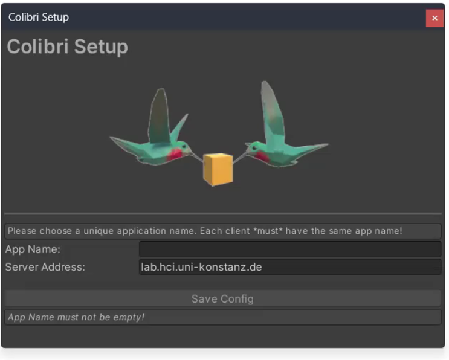
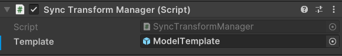
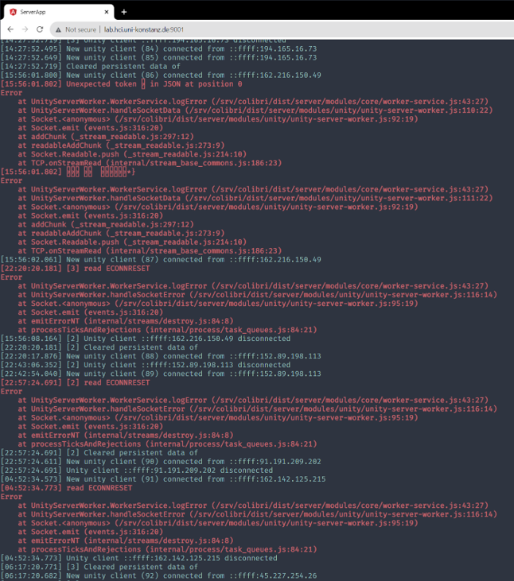

# Colibri Unity guide

Reference for the Colibri Unity package. Installation and first run: [README](../README.md).

## Contents

- Setup
  - [Requirements](#requirements)
  - [Installation](#installation)
  - [Quickstart](#quickstart)
  - [Configuration](#configuration)
  - [TLS](#tls)
  - [Meta Quest and Android](#meta-quest-and-android)
  - [Samples](#samples)
  - [Troubleshooting](#troubleshooting)
- Usage
  - [Sending data between clients](#sending-data-between-clients)
  - [SyncTransform](#synctransform)
  - [SyncBehaviour](#syncbehaviour)
  - [Send rate](#send-rate)
  - [Remote store](#remote-store)
  - [Connection and outages](#connection-and-outages)
  - [Web interface for logging](#web-interface-for-logging)
  - [Voice chat](#voice-chat)
- [Related documents](#related-documents)
- [Development](#development)

## Requirements

- Unity 2022.3 LTS or newer
- colibri-server 2.0.0 or newer

Colibri Unity 2.x uses the [v3 binary TCP protocol](../../colibri-server/docs/protocol.md). It does
not interoperate with 1.x in either direction, and there is no version negotiation. Upgrade server
and clients together.

| Combination | Result |
|---|---|
| Colibri Unity 2.x, colibri-server 1.x | The framings differ, so the server cannot send a refusal. After three connections in a row end before anything readable arrives, *Window → Colibri Status* shows a suspected protocol mismatch in yellow. The client keeps retrying with growing delays up to 10 s, since an address that is not a Colibri server looks the same. |
| Colibri Unity 1.x, colibri-server 2.x | The client gets no refusal. The server logs `Refusing a connection from <address>: it looks like a Colibri 1.x client …`. |
| Same framing, other protocol version, e.g. a future server | The server refuses with a reason, shown in red in *Window → Colibri Status*. The client stops reconnecting ([Protocol mismatch](#protocol-mismatch)). |

## Installation

In *Window → Package Manager → + → Install package from git URL*, enter:

```
https://github.com/hcigroupkonstanz/Colibri.git?path=colibri-unity/Assets/Colibri
```

- The Package Manager must list **Colibri 2.0.0** or newer. UniRx or UniTask errors indicate a 1.x
  install.
- To pin a version, append a [release](https://github.com/hcigroupkonstanz/Colibri/releases) tag,
  e.g. `#v2.0.0`. The Package Manager records the installed commit, so Colibri changes only when you
  update it there.
- The only dependency, `com.unity.nuget.newtonsoft-json`, is installed automatically.

### UnityPackage

Or import the 2.0.0 `.unitypackage`, not a 1.x one, from the [Releases
page](https://github.com/hcigroupkonstanz/Colibri/releases). A `.unitypackage` cannot declare
dependencies. Add `com.unity.nuget.newtonsoft-json` in the Package Manager.

## Quickstart

1. Install Colibri. The configuration window opens automatically.
2. Enter an **App Name** and the **Server Address** of a shared or
   [own](../../colibri-server/README.md#docker) colibri-server 2.x, then click *Save Config*
   ([Configuration](#configuration)).
3. Enable *Project Settings → Player → Resolution and Presentation → **Run In Background***. It is
   off by default. Without it, a background Editor pauses the game and sends and delivers nothing
   until `Update` runs again, while the Status window shows *Connected*.
4. Import the **SendData** sample (*Window → Package Manager → Colibri → Samples → Import*). It
   needs TextMeshPro's essential resources ([Samples](#samples)).
5. For a second client, copy the `Assets`, `Packages` and `ProjectSettings` folders to a new folder
   and open it from Unity Hub. Unity cannot open one project twice. The copy includes the
   configuration and the sample. A build also works, but has no Inspector to enable `SendProperties`
   and logs to a file.
6. Open the sample scene in both Editors and enter Play mode. In one, enable `SendProperties` on
   `[ClickMe]` (component `SendMessages`). The other logs `Received message with value …` for each
   value. The sender logs nothing, since clients never receive their own messages.

If nothing arrives, see [Troubleshooting](#troubleshooting).

## Configuration

*Window → Colibri Configuration* opens the Colibri Setup window. It opens automatically while the
project has no configuration. *Save Config* writes `Assets/Resources/ColibriConfig`.



| Setting | Default | Description |
|---|---|---|
| App Name | empty | Required. Only clients with the same app name exchange data. |
| Server Address | `colibri.hci.uni-konstanz.de` | Host name or IP address of the [server](../../colibri-server), without `http://`. On a headset or phone, `localhost` is the device. Use the server's LAN IPv4 address. The preset public test server works only while it runs colibri-server 2.x. |

- Use an app name that is unique on the server. All clients with one app name see each other's
  objects and messages, and the server's load grows with the square of their number.
- The window warns about these app names, ignoring case: `myAppName` (used by the web client's
  samples), `myApp`, `appName`, `app`, `test`, `testApp`, `demo`, `example`, `colibri`, `default`.
- Valid changes apply at once, without saving. An open connection keeps its server and App Name
  until it reconnects ([Voice chat](#voice-chat)).
- Invalid values, such as port 0, are marked as errors and neither used nor saved. The setting keeps
  its last valid value. The window shows the typed value until you correct it or close the window.
- Changes made elsewhere, such as in the asset's Inspector, appear in the window and are kept.

### Advanced configuration

Ports, TLS and the voice sampling rate under *Optional Config* must match the server. Change them
only if the server does not use the defaults.

| Setting | Default | Description |
|---|---|---|
| Server supports SSL/TLS? | off | Use TLS. Tick when the server has `TLS_CERT` and `TLS_KEY` set ([TLS](#tls)) |
| Allow self-signed certificate | off | Accept a certificate the device does not trust. Only with TLS ([Certificates](#certificates)) |
| Server certificate SHA-256 | empty | Accept only the certificate with this fingerprint. Only with TLS ([Certificates](#certificates)) |
| Web server Port | `9011` | Server's `WEBSERVER_PORT`, used by the Store |
| TCP server Port | `9012` | Server's `TCP_PORT` |
| Voice server Port | `9013` | Server's `VOICE_PORT` |
| Voice Sampling Rate | `48000` | Server's `VOICE_SAMPLING_RATE` |
| Max Send Rate (Hz) | `30` | Updates per second per synced object, `0` for no limit ([Send rate](#send-rate)) |

With TLS off, `Store` requests use plain `http`. Unity blocks `http` except to loopback addresses
such as `localhost`. For other servers, including any server reached from a headset, set *Project
Settings → Player → Other Settings → **Allow downloads over HTTP*** to *Always allowed*, or use
[TLS](#tls). Colibri checks this setting ([Build settings check](#build-settings-check)).

## TLS

*Server supports SSL/TLS?* (`ColibriConfig.IsSSL`) encrypts the TCP connection and switches the
Store to `https`.

- The server needs `TLS_CERT` and `TLS_KEY` ([TLS](../../colibri-server/docs/guide.md#tls) in the
  server guide).
- The setting must match the server. Its TCP port accepts either only TLS or no TLS.
- Frames and protocol version inside TLS are unchanged.
- The handshake must finish within the 5 s connect timeout.
- Unity's TLS backend negotiates TLS 1.2.
- The client sends the *Server Address* as SNI and checks the certificate against it.
- Voice chat (UDP) stays unencrypted.
- The server log uses the Setup window's labels. Colibri's console messages spell the first one
  'Server supports SSL/TLS', without the question mark.

### Certificates

| Certificate | Setting | Result |
|---|---|---|
| Issued by a CA, e.g. Let's Encrypt | none | Checked against the device's trust store, also on Android and the Quest |
| Self-signed, pinned | *Server certificate SHA-256* (`ColibriConfig.ServerCertificateSha256`) | Only this certificate is accepted, trusted or not. Its names are ignored, so IP address certificates work. |
| Self-signed, not pinned | *Allow self-signed certificate* (`ColibriConfig.AllowSelfSignedCertificate`) | Untrusted certificates are accepted. The connection is encrypted, but the server's identity is not checked. The console warns once per session with the fingerprint to pin. |

- Case and colons in the fingerprint are ignored. Anything but 64 hexadecimal digits or empty is an
  error in the Setup window and is neither used nor saved.
- Both settings appear only with *Server supports SSL/TLS?* ticked. Configurations saved before
  these settings existed load with both off, accepting only trusted certificates.
- The Store's `https` requests follow both settings. With neither set, the system checks the
  certificate, as in 1.x.
- Do not pin Let's Encrypt certificates. Each renewal changes the fingerprint.
- The fingerprint appears in the server's startup log
  (`TLS is on, ... SHA-256 fingerprint AB:CD:...`), Colibri's warning or rejection message, and the
  selectable *SHA-256* row of *Window → Colibri Status*.
- Next to the server address, the Status window shows TLS and how the certificate was accepted:
  `trusted by this device`, `matches 'Server certificate SHA-256'` or
  `not trusted, accepted because 'Allow self-signed certificate' is on`.

### TLS errors

| Message | Cause | Fix |
|---|---|---|
| `<host:port> did not answer the TLS handshake …` or `<host:port> accepted the connection but did not answer the TLS handshake within 5 s` | The server has no TLS | Set `TLS_CERT` and `TLS_KEY` on the server, or untick *Server supports SSL/TLS?* |
| `rejected the certificate of <host:port>: it is self-signed …` | Self-signed certificate, neither pinned nor allowed | Pin its fingerprint, or tick *Allow self-signed certificate* |
| `… it expired on <date>` | Expired certificate | Renew it on the server |
| `… it is not issued for '<address>'` | The certificate does not cover the *Server Address* | Connect by a name it covers, pin it, or allow self-signed certificates |
| `… its SHA-256 fingerprint is <X>, not the one in 'Server certificate SHA-256' …` | The server's certificate was replaced | Copy the new fingerprint from the server log |
| `… This usually means a protocol mismatch … tick 'Server supports SSL/TLS' …` | TLS on the server only | Tick *Server supports SSL/TLS?* |

Each error is logged once as an error, then as an info line on each retry. The client keeps
retrying, so a server fix needs no app restart. `LastConnectFailure` and the Status window show the
latest error.

## Meta Quest and Android

Quest apps are Android builds. Switch the platform to Android in *File → Build Settings* (*File →
Build Profiles* in Unity 6). The Quest needs ARM64, which on Android requires IL2CPP.

### Build settings check

Colibri checks two Player settings that otherwise fail only in the built app, which has no console.
It warns after every script reload, including a build target switch, and at the start of every
player build, without stopping it. *Window → Colibri Configuration* lists the issues with fix
buttons under **Android / Meta Quest** (Android target) or **Player build** (other targets).

| Setting (*Player → Other Settings*) | Required | Checked | Warning | Otherwise |
|---|---|---|---|---|
| *Internet Access* | *Require* | Android target | `Colibri (Android build): Internet Access is set to Auto. …` | The build may lack the INTERNET permission that Colibri's sockets need. The app starts and never connects. |
| *Allow downloads over HTTP* | *Always allowed* | All targets, with TLS off and a server other than `localhost` or a loopback address | `Colibri (build): Allow downloads over HTTP is '…' …` | Every `Store` call fails with "Insecure connection not allowed". |

*Allowed in development builds* passes the HTTP check for development builds only.

### Platform notes

- Use the server's LAN IPv4 address, not `localhost`. Voice chat works only over IPv4. A headset
  that cannot reach the server keeps retrying, and [`LastConnectFailure`](#connection-and-outages)
  holds the reason.
- *Run In Background* has no effect on Android.
- Managed code stripping keeps `[Sync]` members. Your classes that only Newtonsoft JSON uses
  (`JToken.FromObject`, `ToObject<T>`, `Store`) are reached only through reflection, so stripping
  above *Minimal* may remove their members. Keep *Managed Stripping Level* at *Minimal*, or preserve
  these classes with `[Preserve]` or a `link.xml`.
- On IL2CPP, `[Sync]` fields are read through reflection, which allocates every frame for a value
  type (`int`, `float`, `Vector3`, …). Properties use a direct delegate. With many synced objects,
  use properties, as `SyncTransform` does.

## Samples

Samples imported in the Package Manager (*Colibri → Samples → Import*) are copied to
`Assets/Samples/Colibri/` for editing. Only imported samples are compiled into the project and
builds.

The `Remote Store`, `SendData`, `SyncTransform` and `Voice Chat` scenes use TextMeshPro, which
Colibri does not install. Without TMP Essential Resources, their instruction text throws a
`NullReferenceException` in `TMP_Settings`. Before opening these scenes:

| Unity | Steps |
|---|---|
| 2022.3 | Install *TextMeshPro* (`com.unity.textmeshpro`) if missing, then run *Window → TextMeshPro → Import TMP Essential Resources*. |
| 6 | TextMeshPro is part of `com.unity.ugui`. Run only the import. |

The `[RemoteLogger]` and `[SyncTransformManager]` prefabs are part of the package, not samples. Drag
them from `Packages/Colibri/Prefabs/` in the Project window.

## Troubleshooting

In Play mode, *Window → Colibri Status* shows:

- connection state, server and app name. A misspelled app name connects normally, but no other
  client ever appears.
- whether the server's heartbeat arrives, and how long it has been missing
- when not connected, why the last attempt failed
- channels with listeners and the type each expects
- the last 20 messages sent and received
- the delivery rate in frames per second, with a warning below 20

A headset has no Status window, and `[RemoteLogger]` cannot forward the console while disconnected.
Show [`LastConnectFailure`](#connection-and-outages) in your app.

### Console messages

| Message | Cause | Fix |
|---|---|---|
| `Colibri: a float arrived on channel 'chat', but the listener registered there expects string. …` | Sender and listener use different types on the channel | Use the same type on both sides |
| `Colibri is not configured yet. Open Window -> Colibri Configuration…` | No App Name set | Enter an App Name and click *Save Config* |
| `Colibri: 192.168.0.10:9012 did not answer within 5 s. …` | Wrong IP, server on another network or subnet, Wi-Fi client isolation, or a firewall dropping packets | Fix the address or the network |
| `Colibri: connection to 192.168.0.10 failed (ConnectionRefused), retrying...` | The machine is reachable, but nothing listens on the TCP port | Start colibri-server, or check *TCP server Port* |
| `… failed (HostUnreachable) …`, `(NetworkUnreachable)` or another socket error | Wrong address or network | Fix the address or the network |
| `Colibri: invalid frame from server, dropping connection: …` if the server sends anything, then `Colibri: 3 connections in a row were accepted but ended before a single frame could be read. …` | A 1.x server, an address that is not a colibri-server, or [TLS](#tls) on the server only. With *Server supports SSL/TLS?* off, also a proxy or port forwarding whose backend is not running. | Use a 2.x server, correct the address, tick *Server supports SSL/TLS?*, or start the server behind the proxy |
| `Colibri: 192.168.0.10:9012 accepted the connection but has not sent anything in 2 s, dropping it` (with TLS also `Colibri: server closed the connection`), then `Colibri: 3 connections in a row to 192.168.0.10:9012 were accepted, but nothing was received on any of them: …` | A proxy or port forwarding whose backend is down, a captive portal or a firewall accepts connections, then closes them or forwards nothing. Or the server does not answer or is not a colibri-server. | Check that colibri-server runs and is reachable at that address and port |
| `… did not answer the TLS handshake …` or `rejected the certificate of …` | TLS settings do not match the server | See [TLS errors](#tls-errors) |
| `Colibri (Android build): …` or `Colibri (build): …` | A Player setting that fails only in the built app (Internet Access, Allow downloads over HTTP) | Click the fix button in *Window → Colibri Configuration* ([Build settings check](#build-settings-check)) |
| `Colibri: cannot synchronize '<class>.<member>' …` at startup | A `[Sync]` member with an unsupported type, a property without both a getter and a setter, or a `readonly` field | Follow the message. Sync classes of your own as `JObject`. |
| `Colibri: could not save "<name>" at <url> …`, `could not load …` or `could not delete …` | A failed `Store` request. The message names the URL, the transport error and the HTTP status. | Check the server address and app name. For "Insecure connection not allowed", see [Advanced configuration](#advanced-configuration). |

### Other symptoms

| Symptom | Cause | Fix |
|---|---|---|
| Two clients do not see each other | Different app names | Compare the names in the log line `Colibri: connected to <host>:<port> as app '<app>'. …` |
| Unknown objects or messages appear | Another project uses the same app name. Unity reports nothing at runtime. | Choose a unique app name ([Configuration](#configuration)). The server log warns, naming the app, above 8 clients by default (`APP_CLIENT_WARNING_THRESHOLD`). |
| One client is connected but sends and receives nothing | Its Editor is in the background with *Run In Background* off | Enable *Run In Background* ([Quickstart](#quickstart), step 3) |

## Sending data between clients

`Sync.Send` publishes a value on a channel from anywhere in your code:

```c#
float myNumber = 5;
Sync.Send("MyChannel", myNumber);
```

The server forwards the message to all other clients with the same app name, never to the sender.

`Sync.Receive` registers a listener for a channel and a type:

```c#
void Start() {
    Sync.Receive<float>("MyChannel", MyListener);
}

private void MyListener(float myNumber) {
    // Runs whenever a float
    // arrives on "MyChannel"
}
```

- A listener that is a method of a `MonoBehaviour`, or a lambda written inside one, is removed when
  the component or its GameObject is destroyed. Destroyed objects are never called and cannot throw
  `MissingReferenceException` in Colibri's message loop.
- `Sync.Unregister` removes a listener while its object lives on:

  ```c#
  private void OnMenuClosed() {
      Sync.Unregister<float>("MyChannel", MyListener);
  }
  ```

- Colibri cannot track the lifetime of `static` methods and plain C# objects. Remove such listeners
  with `Sync.Unregister`.

### Supported types

`bool`, `int`, `float`, `string`, `Vector2`, `Vector3`, `Quaternion`, `Color`, and arrays of these.

### JSON

Send other types as JSON (Newtonsoft JSON):

```c#
Sync.Send("myJson", new JObject
{
    { "attribute1", "example" },
    { "attribute2", 5 }
});

Sync.Receive<JToken>("myJson", MyListener);

private void MyListener(JToken jtoken) {
    string attribute1 = jtoken["attribute1"].Value<string>(); 
    int attribute2 = jtoken["attribute2"].Value<int>();
}
```

Newtonsoft JSON converts your own classes. `[Serializable]` is optional:

```c#
using System;

[Serializable]
public class ExampleClass
{
    public int Id;
    public string Name;
}
```

```c#
ExampleClass exampleObject = new ExampleClass();
exampleObject.Id = 1234;
exampleObject.Name = "Charly Sharp";

Sync.Send("example", JToken.FromObject(exampleObject));
```

```c#
Sync.Receive<JToken>("example", MyListener);

private void MyListener(JToken jtoken) {
    ExampleClass exampleObject = jtoken.ToObject<ExampleClass>();
}
```

Newtonsoft JSON cannot convert a `Vector3`, `Quaternion` or `Color` inside your class. A plain
`JToken.FromObject` throws a `JsonSerializationException`, for a `Vector3` with
`Self referencing loop detected for property 'normalized'`. Pass `ColibriJson.Serializer`, which
converts `Vector2`, `Vector3`, `Vector4`, `Quaternion` and `Color` to arrays of their components and
back:

```c#
using HCIKonstanz.Colibri.Synchronization; // ColibriJson

Sync.Send("example", JToken.FromObject(exampleObject, ColibriJson.Serializer));

private void MyListener(JToken jtoken) {
    ExampleClass exampleObject = jtoken.ToObject<ExampleClass>(ColibriJson.Serializer);
}
```

Or build the `JObject` with Colibri's conversion methods:

```c#
using HCIKonstanz.Colibri.Synchronization; // ToJson(), ToVector3(), ToQuaternion(), ToColor()

Sync.Send("spawn", new JObject
{
    { "Id", 1234 },
    { "Position", transform.position.ToJson() }
});

private void OnSpawn(JToken jtoken) {
    Vector3 position = jtoken["Position"].ToVector3();
}
```

Colibri converts a `Vector3`, `Quaternion` or `Color` that is sent directly or is a `[Sync]` member,
so these need neither.

### Limitations

- Register the listener before data is sent.
- Channel and type must match on both sides. On a mismatch, the console names the channel, both
  types and the fix.

## SyncTransform

`SyncTransform` syncs an object's active state, position, rotation and scale between all clients.
`SyncActive`, `SyncPosition`, `SyncRotation` and `SyncScale`, all on by default, select what is
synced. `UseLocalTransform` syncs local instead of world coordinates. See the SyncTransform sample.

### Server state

- The server stores each object's state and sends it to clients that connect later.
- The object requests the state in `Awake` and gets it a round trip later, or once connected.
- Members changed before the answer, e.g. in `Start`, in `OnConnected` or right after entering Play
  mode, keep their values. These replace the server's values here, on the server and on all other
  clients.
- All other members take the server's values, so scene and prefab values do not overwrite them. For
  model scripts of your own, see [Awake and OnDestroy](#awake-and-ondestroy).
- A script that moves the object in `Start` therefore moves it for everyone whenever a client
  starts. Set starting positions in the scene.
- Moving objects send at most 30 updates per second by default ([Send rate](#send-rate)).

### Showing, hiding and deleting

- `SetActive(false)` hides the copies on other clients, `SetActive(true)` shows them again. Only the
  object's own flag (`activeSelf`) is synced, so deactivating a parent has no effect elsewhere. With
  `SyncActive` off, the active state stays local.
- Disabling only the `SyncTransform` component pauses syncing without hiding anything. Changes made
  meanwhile are sent when it is enabled again.
- Destroying the object or unloading its scene, also by loading another scene in its place, deletes
  it on the server and all clients. The server and this client ignore an update another client sent
  before the delete reached it.
- Loading the scene again, on any client, lets its placed objects sync again between all clients
  that load it from then on, because the server no longer treats them as deleted. A client that kept
  the scene open lost its copies with the delete. It gets them back only by loading the scene again,
  or from a manager with a `Template` for them, which builds them from the next update.
- Leaving Play mode, quitting or killing the app deletes nothing, whether the object is shown or
  hidden. It stays on the server until the app's last client disconnects ([Connection and
  outages](#connection-and-outages)).

### Physics

- `PhysicsAuthority` marks the one client that controls the object's physics. Setting it to `true`
  on one client sets it to `false` on all others. If it is ticked by default, the first client gets
  the authority.
- Until the server's state arrives, the `Rigidbody` stays kinematic regardless of
  `PhysicsAuthority`, so a client that joins later starts from the shared position, not from its own
  simulation.
- An object instantiated on this client with an empty `Id` is simulated at once, because the server
  has no state for it.
- If the connection is not up 5 s (the connect timeout) after Colibri opened it or after it dropped,
  the object stops waiting once no connect attempt is running. Attempts also give up after 5 s. The
  object is then simulated according to `PhysicsAuthority`, and the console warns once per session:
  `Colibri: no connection to a server for 5 s, so placed SyncTransforms with a Rigidbody and PhysicsAuthority ticked are simulated without the server's state; …`.
- When a server answers later, the position the object reached replaces the shared one on all
  clients. Start colibri-server before the clients.
- `isKinematic` of the `SyncTransform` overwrites `isKinematic` of the `Rigidbody`. Change it on the
  `SyncTransform`, not only on the `Rigidbody`.

### Objects created at runtime

1. Add the `[SyncTransformManager]` prefab from `Packages/Colibri/Prefabs/` to the scene.
2. Set its `Template` to a prefab of the object.
3. Set the prefab's `ModelId` to a value that identifies the prefab, and leave its `Id` empty.

When a client instantiates an object with a `SyncTransform` and this `ModelId`, the manager on the
other clients creates it from the prefab and syncs it. The `Template` can also be an inactive scene
object ([SyncBehaviour](#syncbehaviour)).



### Limitations

These also apply to every `SyncBehaviour`.

- Update each member from one client at a time.
- The scene is reset when all clients disconnect.

## SyncBehaviour

`SyncBehaviour<T>` syncs data models, e.g. in a model-view-controller architecture. It needs a model
script and a manager script.

The model script inherits from `SyncBehaviour<T>` instead of `MonoBehaviour`. `[Sync]` marks the
properties and fields to sync:

```c#
public class MyClass : SyncBehaviour<MyClass>
{
    [Sync]
    public string MyString = "123";

    [Sync]
    private Vector3 Position
    {
        get { return transform.localPosition; }
        set { transform.localPosition = value; }
    }
}
```

The manager needs only a matching declaration:

```c#
public class MyClassManager : SyncBehaviourManager<MyClass>
{
    // No code needed. Add this script to the scene,
    // e.g. on an empty GameObject.
}
```

Add the manager to the scene and set its `Template` to a prefab with the model script.

- The `Template` can also be an inactive scene object. An active one would also sync as an object of
  its own.
- The manager activates every copy it builds, so the copy runs `Awake`, and then applies the synced
  state. A `SyncTransform` copy of an object hidden elsewhere is therefore deactivated at once, and
  shown when the original is.
- `SyncTransform` is a `SyncBehaviour`. Its rules for server state, disabling, destroying and
  quitting apply to every `SyncBehaviour`. Only the active state is specific to `SyncTransform`.

### Awake and OnDestroy

A `SyncBehaviour` registers in `Awake` and unregisters in `OnDestroy`. To use them, override them
and call the base method:

```c#
protected override void Awake()
{
    // set up what your [Sync] getters read, such as a cached component
    base.Awake();
    // your code
}
```

A plain `void Awake()` or `void OnDestroy()` hides the base method, and only compiler warning CS0114
reports it. Without `base.Awake()`, the object never syncs. Without `base.OnDestroy()`, destroying
it does not delete it on the other clients.

- On objects placed in the scene or created on this client, a `[Sync]` member set after
  `base.Awake()` counts as a change ([Server state](#server-state)). To take the server's state
  instead, set initial values before `base.Awake()` or in the Inspector.
- A copy that a manager builds from another client's update takes the values of that update,
  whatever its `Awake` sets.
- `base.Awake()` reads every `[Sync]` member once, and the server's first answer is compared with
  these values. Set up whatever a getter reads before `base.Awake()`. A getter that reads a
  component cached later returns its fallback first and the real value afterwards. This counts as a
  change too, so each client that starts sends its own value over the server's.

## Send rate

A synced object (`SyncTransform` or any other `SyncBehaviour`) sends at most **30 updates per
second** by default. Without a limit, a moving object sends an update every frame, 72 to 120 per
second on a headset. Dozens of headsets doing that overload one server and one Wi-Fi network.

- A single change is sent in the frame it is made.
- Faster changes are collected. Their latest values are sent together when the interval (1/30 s)
  ends, even if nothing changes afterwards.
- Values in between are never sent. A synced object shares its current state, not every step, so a
  `[Sync]` setter on another client does not see every value either. Use `Sync.Send` for events that
  must all arrive.
- `SetActive` sends pending changes at once, for a `SyncTransform` including the hide or show.
- Destroying the object sends its delete at once and drops any pending change.
- Pending changes are sent at once when the app pauses or loses focus. On a Quest, this happens when
  the headset is taken off, the system menu opens or the user leaves the app.
- When the app quits or Play mode ends, pending changes are sent as a best effort only, because the
  connection closes in the same teardown.
- A value from another client replaces a pending local change of the same member, so all copies end
  up with the same value.

Change the limit in *Window → Colibri Configuration → Optional Config → Max Send Rate (Hz)*, or at
runtime:

```c#
using HCIKonstanz.Colibri.Synchronization;

SyncSettings.MaxSendRate = 60; // updates per second per synced object; 0 = no limit
```

- A value set from code applies to the current run only (in the Editor: the Play session) and does
  not change the configuration.
- A negative value throws an `ArgumentOutOfRangeException`.
- `0` disables the limit. An update then goes out in every frame with a change, as in Colibri 1.x.
  The configuration window warns about it.
- A configuration saved before this setting existed uses 30.

## Remote store

`Store` saves data per app name on the server through its REST interface, so it persists between
sessions. It takes anything Newtonsoft JSON can serialize, such as an object of your own class (also
with `Vector3`, `Quaternion` or `Color` fields), a list, a number or a string, up to 5 MiB of JSON
per name.

```c#
// Create example object
ExampleClass exampleObject = new ExampleClass();
exampleObject.Id = 1234;
exampleObject.Name = "Charly Sharp";

// Save example object using REST API
bool putSuccess = await Store.Put("exampleObject", exampleObject);
Debug.Log($"Success: {putSuccess}");
```

```c#
ExampleClass exampleObject = await Store.Get<ExampleClass>("exampleObject");
if (exampleObject != null)
{
    // Use fetched "exampleObject"
}
else
{
    Debug.LogError("Get Example Object failed!");
}
```

`await Store.Delete("exampleObject")` deletes the value and returns `false` on failure.

- Values are fetched only on request. They do not update automatically.
- Newtonsoft JSON saves the public fields and properties of your class. `[Serializable]` is not
  needed. A private `[SerializeField]` field is not saved.
- A `Vector2`, `Vector3`, `Vector4`, `Quaternion` or `Color` inside your class is converted with
  [`ColibriJson`](#json) and saved as an array of its components. Values Colibri 1.x saved as
  `{"x": …}` still load.
- Failures do not throw. `Store.Put` returns `false` if the value cannot be converted or the server
  did not store it. `Store.Get<T>` returns `default` if the request fails, nothing is saved under
  the name, or the saved value does not fit `T`. Both log the reason.
- A saved `null` is returned as `null`. Exceptions thrown by your own class, e.g. by its
  constructor, pass through.
- Requests give up after 10 s.
- The app name and the name you save under are URL-encoded. Names with `/`, `#`, `?`, `%` or spaces
  work and address the same value as in colibri-web.

## Connection and outages

Colibri connects when anything first calls `Sync.Send` or `Sync.Receive`, or a `SyncBehaviour` runs
`Awake`. After a drop it reconnects with delays of 0.5 s, 1 s, 2 s and so on up to 10 s. An attempt
without an answer is abandoned after 5 s.

| `WebServerConnection.Instance` member | Description |
|---|---|
| `Status` | `ConnectionStatus`: `Connecting`, `Connected`, `Reconnecting`, `Disconnected` or `ProtocolMismatch` |
| `OnConnected` | Raised on the main thread once the server has sent something, not when TCP accepts the connection |
| `OnDisconnected` | Raised once for every `OnConnected`, when that connection ends |
| `LastConnectFailure` | Why the last attempt failed, e.g. `… did not answer within 5 s` or a refusal. `null` once connected. |
| `Connected` | Task that completes once connected. Cancelled when the server refuses the protocol version or the component is disabled, so `await` then throws a `TaskCanceledException`. |
| `ServerVersion`, `ProtocolMismatchReason` | The server's answer to a refused protocol version |
| `SuspectedProtocolMismatch` | A mismatch the server could not report ([Requirements](#requirements)) |

An attempt that never connected raises no event. Events are raised in order, so the last one raised
is the current state. A drop and reconnect between two frames raises `OnDisconnected`, then
`OnConnected`.

### Sending during an outage

Messages sent while disconnected wait. After the reconnect they go out in order, before anything
sent later.

- **Broadcasts** (`Sync.Send`): at most 256 wait. Beyond that the oldest are dropped, with one
  warning per outage.
- **Log lines** wait in `[RemoteLogger]`, which keeps the newest 1000 ([Web interface for
  logging](#web-interface-for-logging)). Only lines it handed over before the drop count toward the
  256.
- **Synced object changes** are exempt from the 256 limit. Changes to one object are merged into one
  update, newer values winning.
- **Total:** at most **10 000 messages** wait, during an outage or on a link too slow for the
  traffic. Beyond that, the oldest broadcasts and log lines are dropped first, then the oldest
  synced-object requests, updates and deletes, which other clients then never see. The console warns
  once per connection: `Colibri: more than 10000 messages are waiting to be sent…`.

### Receiving while Update does not run

Received messages wait for `Update`. `Update` does not run while the app is paused, such as a Quest
with the headset off, or while the Editor is in the background without *Run In Background*. Colibri
keeps reading meanwhile, so the server does not drop the client.

- Beyond 1000 waiting messages, updates for one object are merged, newer values winning. Listeners
  then see only the newest state of each object for that period.
- Beyond 10 000, the oldest messages are dropped, broadcasts first.
- The console warns once per connection:
  `Colibri: … received messages waited for Update, which did not run for a while…`.

### After a reconnect

Colibri requests every synced object in the scene and everything on its `SyncBehaviourManager`
channels again, to receive changes made meanwhile. The server answers each object with:

- **its current state**, applied unless it reveals a lost change of this client ([Lost
  changes](#lost-changes))
- **nothing**, if the server forgot the app's objects because the server restarted or the app's last
  client disconnected. A single client whose connection drops is that last client. Colibri then
  sends the full state again, for the server and for clients that join later.
- **a delete** by another client during the outage, applied here too

An object changed during the outage sends only its merged update, ahead of the request. A server
that forgot the object creates it with only the changed members and answers with them. The other
members reach the server only when they change. Until then, clients that join later use the
template's values for them, shown even if the object is hidden here. Placed objects keep their scene
values.

### Lost changes

A change made as the Wi-Fi drops goes into a dead connection and is lost. The client notices the
drop 2 s later, when heartbeats stop, and the server's answer holds the value from before the
change.

To detect this, each `[Sync]` member keeps the values it sent around the time the client last heard
from the server, which heartbeats every 100 ms. These are the last 8 up to then, the first 8 after,
the newest, and the value held before those, which is the last one dropped or the last one received
from the server. The value the server holds stays among them until all answers are in, however many
later changes were lost or made after the reconnect.

Until all answers are in, everything that arrives for the object, other clients' updates included,
is compared with the values the member held since 10 s before the outage was noticed. These are the
values it sent since and the one it held then, e.g. `true` for an object switched on a minute ago.

| Arriving value | Result |
|---|---|
| The value sent last | The change arrived. |
| An earlier one | The next change was lost. The member keeps its value and sends it again, once. |
| Any value, if the member changed after the request | The same. The server reads that change after the answer. |
| A value the member did not hold | Another client's change during the outage. Applied. |
| Any value, if the member sent nothing in those 10 s, or the object never sent anything | Applied |

A second drop before all answers are in still counts from the first outage. The comparison uses
values, so some cases go wrong:

- Another client that sets a member back during the outage, to a value this client held in those
  10 s, is undone.
- More than 8 changes of a member within about 100 ms of the last heartbeat may go unrecognised, so
  the answer is applied. This needs a send-rate limit above about 80 per second, or none.
- More than one change between a reconnect and a second drop, before all answers are in, may go
  unrecognised too.
- A member whose first value ever was lost is not sent again.

### Lost deletes

Deletes made as the Wi-Fi drops are lost the same way. When the outage is noticed, Colibri sends
again the deletes made since the client last heard from the server or in the second before.

- Deletes made 60 s or more before the outage was noticed are not sent again.
- On a second drop before all answers are in, these deletes go out once more, whatever their age, as
  do deletes made since the outage was noticed, unless the object was created on this client again.
- Like any delete during an outage, a delete sent again also removes an object another client
  created under the same id meanwhile.

The server remembers deletes for `MODEL_TOMBSTONE_SECONDS`, 10 minutes by default. For an object
another client deleted longer ago while this client was away, the server answers with nothing, so
this client sends it again and recreates it. See [After a
reconnect](../../colibri-server/docs/protocol.md#after-a-reconnect) in the protocol documentation.

### Protocol mismatch

A refused protocol version is final. `Status` becomes `ProtocolMismatch`, the client stops
reconnecting, and queued and later messages are dropped with a one-time warning. `ServerVersion` and
`ProtocolMismatchReason` hold the server's answer. Disable and re-enable the `WebServerConnection`
component to retry. A mismatch the server cannot report appears in `SuspectedProtocolMismatch`
instead, and the client keeps retrying.

## Web interface for logging



The web logger sends diagnostic data, currently console logs, to the server's web interface. Use it
on devices without an accessible console, such as VR headsets and smartphones.

Add the `[RemoteLogger]` prefab to the scene. The Unity log then appears at
`http://<your-server-ip>:9011`.

- Log lines are sent once per second. Identical lines in one batch are sent once.
- Between two sends, at most the newest 1000 lines are kept. During an outage, this covers the whole
  outage, and the lines are sent once the connection is back.
- Where older lines were dropped, the server log shows one line instead:
  `Colibri: N log lines are missing here …`. The device's own log keeps everything.
- If the server refuses the client's protocol version, the kept lines are discarded.

## Voice chat

`VoiceBroadcast` records the microphone and streams the audio. Add it to an empty GameObject. Call
`StartBroadcast` with any `short` voice id except `0`, and `StopBroadcast` to stop:

```c#
// The VoiceBroadcast component, assigned in the Inspector
public VoiceBroadcast Broadcast;

void Start()
{
    // Create random voice id
    short voiceId = (short)UnityEngine.Random.Range(1, 32000);
    Broadcast.StartBroadcast(voiceId);
}
```

On Android (Meta Quest), `VoiceBroadcast` requests the microphone permission when it starts. If the
permission is refused, it logs an error and does not broadcast.

`VoiceReceiver` plays the voice of one voice id. Add it to a GameObject, usually a user
representation such as an avatar. Adding it also adds an `AudioSource`. For several receivers, make
a prefab. Call `StartPlayback` with the voice id to play. Distribute voice ids with `Sync.Send`:

```c#
void Start()
{
    Sync.Receive<int>("VoiceChat", OnIdArrived);
}

private void OnIdArrived(int id) 
{
    GameObject voiceReceiverPrefab = Instantiate(VoiceReceiverPrefab);
    voiceReceiverPrefab.GetComponent<VoiceReceiver>().StartPlayback((short)id);
}
```

The `Samples/VoiceChat` sample is a complete voice chat, with a `VoiceManager` that handles voice
ids and instantiates `VoiceReceiver` prefabs.

- **Codec:** raw PCM by default. To reduce bandwidth, enable *Use Opus Codec* on both
  `VoiceBroadcast` and `VoiceReceiver`. Opus works on Windows, Linux and Android.
- **Spatial audio:** the voice plays at the `VoiceReceiver`'s position. Enable *Spatialize* on the
  `AudioSource` and set *Spatial Blend* to `1` (3D). Spatializer plugins set in the audio settings
  also work.
- **IPv4:** the voice server listens on IPv4 only. Colibri sends voice to an IPv4 address of the
  server, so `localhost` also works on Windows, where it resolves to `::1` first. If the address has
  no IPv4 address or cannot be resolved, Colibri logs an error and turns voice chat off.
- **Apps:** the server forwards voice only to clients with the same *App Name*, so voice ids must be
  unique only within an app. Each voice packet carries an app id, a hash of the App Name ([Voice
  packets](../../colibri-server/docs/protocol.md#voice-packets-udp)). Without an App Name, no voice
  is sent, and Colibri logs an error once.
- **App Name changes at runtime:** voice moves to the new app from the next frame on. Synced objects
  and `Sync` messages, such as voice ids sent with `Sync.Send`, stay in the old app until
  `WebServerConnection` reconnects. Disable and re-enable that component to move them too.
- **Colibri 1.x clients** are not heard. The server drops their voice packets, which have no app id.
- A client receives voice only while its own `VoiceBroadcast` is broadcasting, because the server
  registers voice clients by the voice they send.

### Limitations

- Limited scalability: each voice packet goes to every other broadcasting client of the app.
- Limited security: the app id separates apps like the App Name does for synced objects, but it is
  not access control. Anyone who knows the App Name can receive the app's voice. Voice is not
  encrypted, even with TLS on.
- High bandwidth without Opus.

## Related documents

- [MIGRATION.md](../../MIGRATION.md): upgrading a Colibri 1.x project, for all three components.
  Read it with the changelog's [Breaking changes](../CHANGELOG.md#breaking-changes).
- [CHANGELOG.md](../CHANGELOG.md): all changes from `1.3.1` to `2.0.0`
- [v2-ease-of-use-and-performance.md](v2-ease-of-use-and-performance.md): design of the sync loop
  and the diagnostics, and migrating an existing project
- [colibri-server/docs/protocol.md](../../colibri-server/docs/protocol.md): the v3 wire protocol

## Development

### Running the tests

```sh
node colibri-unity/run-tests.mjs              # both suites
node colibri-unity/run-tests.mjs --editmode   # unit tests only, no server needed
node colibri-unity/run-tests.mjs --playmode   # end-to-end only
node colibri-unity/run-tests.mjs --editmode --stripping   # plus the code-stripping check
node colibri-unity/run-tests.mjs --tls        # plus the PlayMode suite again, over TLS
```

| Suite | Location | Description |
|---|---|---|
| EditMode | `Assets/Colibri/Tests/Editor/` | NUnit tests of the framing, JSON conversions, diagnostics, outage queue, message dispatch, `[Sync]` accessors (including the IL2CPP path), send-rate limit, connect timeout, build settings check, app-name warning, and the voice server address, packet format and packet queue. No server needed, runs wherever Unity runs. |
| PlayMode | `Assets/Tests/` | A Unity client and a raw v3 peer against a running `colibri-server`. Reconnects go through a proxy the test can cut. Mismatch detection runs against a scripted stand-in server. |

The script starts the PlayMode server with `docker compose` and stops it afterwards. A server
already listening on the port is used as it is and left running.

`--stripping`, off by default, checks whether `[Sync]` members survive managed code stripping. The
Editor never strips, so the script builds a Release IL2CPP player of `Assets/StrippingCheck/` for
the Editor's desktop platform with *Managed Stripping Level* High, and runs it.

- The player checks that every `[Sync]` member of `SyncTransform` and of a test model (a private
  serialized field, public value and reference fields, a property) still has its `[Sync]`, applies
  an update to each, and checks the values.
- It prints the result lines and exits with 1 on any failure.
- The check needs no server, takes a few minutes, and needs the IL2CPP module for the platform.
  Without the module, it is skipped with a notice.
- `ProjectSettings` are restored exactly after the build.

For PlayMode, the script also starts a TLS server from `tls-test-server/compose.yml`
([README](../tls-test-server/README.md)) on ports 9111 (https) and 9112 (TLS), for `TlsTests` and
`StoreOverTlsTests`. Without it, these tests are skipped, and the script reports this.

- `--tls` runs the PlayMode suite again with every connection over TLS, including the tests' own
  fake server and proxy, into `TestResults/PlayMode-TLS.xml` and `.log`.
  `ProtocolMismatchDetectionTests` skip themselves in that run. Without the TLS server, `--tls`
  fails.
- The certificate files in `tls-test-server/` (`cert.pem`, `key.pem`, `cert.pfx`) are public and for
  tests only.

Results go to `TestResults/` as NUnit XML plus the Editor log. Without a reachable server, the
end-to-end tests are skipped, not failed, and name the command that fixes it. The script reports a
suite in which every test was skipped as failed.

Windows refuses connections to a full listen backlog instead of leaving them unanswered, so these
connect-timeout tests are skipped there:
`ConnectTimeoutTests.AnAttemptNothingAnswersIsGivenUpAfterTheTimeout`,
`ConnectTimeoutTests.CancellingGivesUpTheAttemptAtOnce` and
`ProtocolMismatchDetectionTests.AnAttemptNothingAnswersIsGivenUpAfterFiveSecondsAndRetried`. On
Windows, check manually that a client with an unreachable server address leaves *Connecting* after
5 s.

| Variable | Default | Description |
|---|---|---|
| `COLIBRI_E2E_SERVER` | unset | Host of a server to use instead of starting one. When set, the script never starts or stops anything. |
| `COLIBRI_E2E_PORT` | `9011` | Web/Socket.IO port |
| `COLIBRI_E2E_TCP_PORT` | `9012` | Binary v3 port |
| `COLIBRI_E2E_NO_BUILD` | unset | Skip `docker compose --build` |
| `COLIBRI_E2E_TLS_PORT` | `9111` | TLS server's web port (https) |
| `COLIBRI_E2E_TLS_TCP_PORT` | `9112` | TLS server's binary v3 port (TLS) |
| `COLIBRI_E2E_TLS_CERT` | `tls-test-server/cert.pem` | TLS server's certificate |
| `COLIBRI_E2E_TLS` | unset | `1` runs the PlayMode suite over TLS. `--tls` sets it. |
| `COLIBRI_E2E_TLS_PFX` | `tls-test-server/cert.pfx` | Certificate the tests' own fake server and proxy serve over TLS |
| `UNITY_PATH` | Unity Hub's location | Editor to use |

The script requires the exact Editor version in `ProjectSettings/ProjectVersion.txt` unless
`UNITY_PATH` is set. Another version would upgrade the project in place, turning a test run into a
diff across the manifest and half of `ProjectSettings`. If the version is missing, the script lists
the installed ones with the `UNITY_PATH` to use. Commit such an upgrade deliberately, not with an
unrelated change. The package supports Unity 2022.3 LTS and newer. The pinned version is only what
the development project is opened with.

Both suites also run in **Window → General → Test Runner**. The end-to-end tests enable *Run In
Background* themselves. For the TLS tests, start the TLS server with
`docker compose -f colibri-unity/tls-test-server/compose.yml up -d --build`. For a run over TLS,
also set `COLIBRI_E2E_TLS=1` in the Editor's environment.

Voice chat has no end-to-end tests, because they need a microphone. Unit tests cover only the server
address choice, the packet format with its app id, and the queue that hands received packets to the
main thread.
